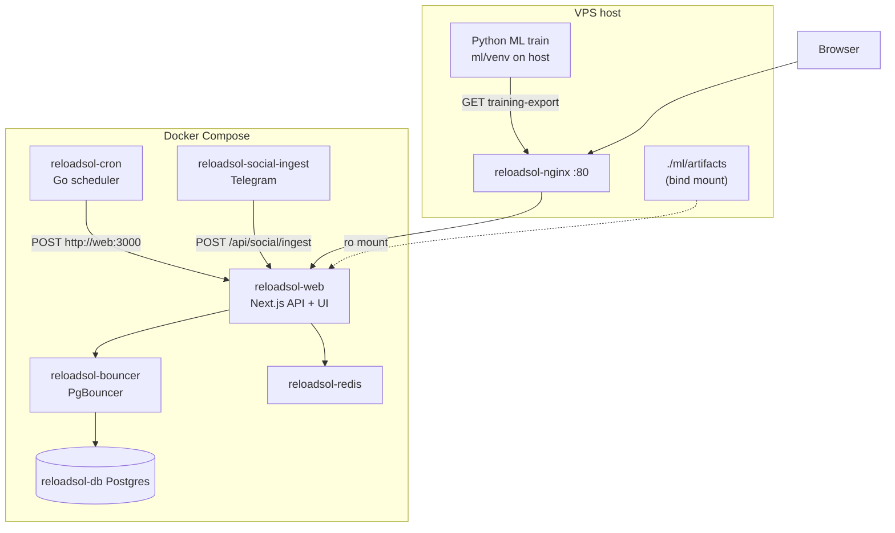
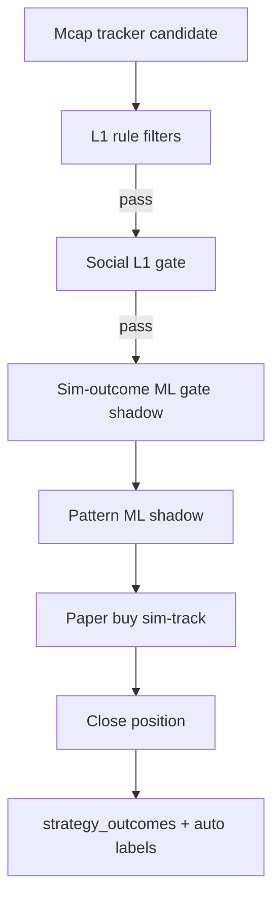
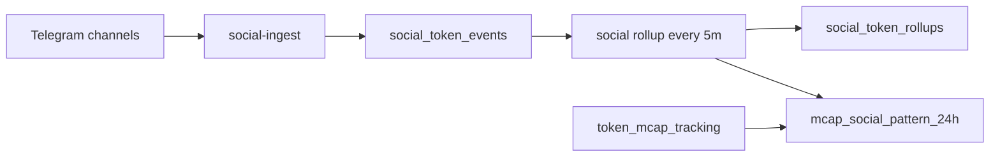

# ReloadSOL — Architecture Summary

Single-page overview: what the system does, how algo + social + ML fit together, and what to do next.

Related deep dives: [architecture.md](./architecture.md), [algo_overview.md](./algo_overview.md), [ML_GATE_PLAN.md](./ML_GATE_PLAN.md), [OPERATOR_STATE.md](./OPERATOR_STATE.md).

---

## 1. Main function

**ReloadSOL** is a Solana memecoin trading platform that combines:

- **Manual trading** — bulk buy/sell, Jupiter swaps, PnL tracking, wallet ops
- **Automated strategies** — trending bot, signals paper trading, DLMM liquidity agent
- **Research loop** — paper sims → labeled outcomes → ML shadow scoring → (future) enforce gates

**North star:** strict checker over brilliant maker. Primary thesis is **`mcap_enter_at_80`** paper sim at the 80% mcap milestone; **Pattern ML** (24h cohort labels) is the primary ML focus.

**Data layer:** Docker Postgres **`reloadsol_db`** only. Supabase is **cut off**. Schema source: [`db/init/`](../db/init/) (`02-schema.sql` + migrations `04`–`13`). [`supabase/schema.sql`](../supabase/schema.sql) is a legacy mirror.

Related: [GMGN_STRATEGY.md](./GMGN_STRATEGY.md) (Radar live thread + comeback).

### Runtime stack (Docker on server)



| Service | Role |
|---------|------|
| **web** | Next.js App Router, ~50+ API routes, strategy admin, sim-track, ONNX shadow scorers |
| **cron** | Go worker scheduler (trending, sim-track, social rollup, DLMM, etc.) |
| **nginx** | Public HTTP :80 → web (prod hides web :3000 from host) |
| **postgres + pgbouncer** | All app data; init from `db/init/*.sql` |
| **social-ingest** | Telethon sidecar → Telegram mentions/wallet buys → API |
| **host ML** | LightGBM train/export **not** in containers; ONNX mounted into web |

**Important:** On prod, API calls from the host use `API_BASE_URL=http://127.0.0.1` (nginx), not `localhost:3000`.

---

## 2. Algo (rules, workers, data)

### Three strategy domains

| Domain | UI | Worker | Outcomes on close |
|--------|-----|--------|-------------------|
| **trending_bot** | `/dev/algo-tester`, `/dev/strategies` | `POST /api/trending/track` (~5m) | `recordTrendingBotOutcome` |
| **signals** | `/dev/signals` | `POST /api/signals/sim-track` (~120s) | `recordSignalsOutcome` |
| **dlmm** | `/dev/dlmm` | screen + manage cron | `recordDlmmOutcome` |
| **mcap_tracker** | mcap sim strategies | `POST /api/mcap-tracking/sim-track` | `recordMcapTrackerOutcome` |

Config: [`src/strategies/registry.ts`](../src/strategies/registry.ts) + `strategy_definitions` DB overrides. Admin: `/dev/strategies`.

Execution modes: `sim_only` | `live_only` | `ab_parallel`.

### Entry pipeline (mcap sim — primary ML path)



**L1 rules** ([`mcap-sim-track.ts`](../src/utils/mcap-sim-track.ts)): mcap band, milestone entry, rug list, max open positions, duplicate guards.

**Social L1** ([`social-snapshot.ts`](../src/strategies/social-snapshot.ts)): min mentions 30m, smart-wallet buy, staleness — shadow mode can log without blocking.

**Social ingest → rollups → patterns**



- **Rollups:** per-token mention counts, channels, smart-wallet buys (powers social gates + ML features).
- **24h patterns:** tokens with `first_seen_at` in last 24h, classified:
  - **Winner:** `mcap_growth_percent ≥ 120%`
  - **Loser:** `mcap_growth_percent < 80%`
  - **Neutral:** 80–119% (not stored)
- Combined snapshot: mcap row + social events JSON ([`combined-pattern.ts`](../src/strategies/social/combined-pattern.ts)).
- UI: `/dev/social` → **24h Patterns**; auto-refresh via social rollup cron (no extra worker).

### Key tables

| Table | Purpose |
|-------|---------|
| `token_mcap_tracking` | Live mcap milestones, growth % |
| `social_token_events` | Raw Telegram/social events |
| `social_token_rollups` | Aggregated social metrics per token |
| `mcap_social_pattern_24h` | Winner/loser cohort snapshots for pattern ML |
| `strategy_outcomes` | Closed trades + entry features + ML labels |
| `market_regime_tags` | Daily regime for L3 / reporting |

### Cron workers (Go → web API)

Examples: `trending_track`, `signals_sim_track`, `mcap_tracker_sim_track`, `social_rollup` (300s), `social_wallet_poll`, `social_cleanup`, DLMM screen/manage.

Workers tab: `/dev/strategies` → Workers (needs `CRON_SERVICE_URL`).

---

## 3. ML

**Primary focus: Pattern ML (Track B).** Sim-outcome gate (Track A) is secondary.

Two **parallel** ML tracks — different labels, same entry-feature philosophy (no leakage).

### Track B — Pattern gate (24h mcap + social cohorts) — PRIMARY

**Question:** “Does this token look like past 24h winners or losers?” (growth cohort, not sim PnL)

| Item | Detail |
|------|--------|
| Labels | `pattern_class`: winner=1, loser=0 from `mcap_social_pattern_24h` |
| Features | [`pattern-features.ts`](../src/strategies/social/pattern-features.ts): log first mcap, mentions/channels 30m, minutes to first mention, wallet buys, GMGN FOMO source flag |
| Train (host) | `API_BASE_URL=http://127.0.0.1 npm run ml:export-patterns && npm run ml:train-pattern` |
| Artifacts | `ml/artifacts/pattern-gate/model.onnx` + `model.meta.json` |
| Runtime | [`entry-pattern-scorer.server.ts`](../src/strategies/entry-pattern-scorer.server.ts) |
| Shadow fields | `ml_pattern_p_winner`, `ml_pattern_predicted` |
| Docker | `./ml/artifacts:/app/ml/artifacts:ro`, `ML_PATTERN_ARTIFACT_DIR=/app/ml/artifacts/pattern-gate` |
| Enforce | `ML_PATTERN_MODE=enforce` only when `pattern_ready` (macro-F1 ≥ 0.60) |
| **Current baseline** | macro-F1 **0.468**, class-1 recall **0** on test (n=8), train `{0:280, 1:50}` → **shadow only** |

### Track A — Sim-outcome gate (Layer 2) — secondary

**Question:** “Will this paper trade be worth entering?” (PnL tiers after close)

| Item | Detail |
|------|--------|
| Labels | `training_class` 0–4 from closed PnL; `gate_class` binary for v2-gate |
| Features | Entry mcap, organic, holders, age, volume, template, optional social v2 |
| Train | `npm run ml:export` → `ml:train-gate` / `ml:train-potential` |
| Artifacts | `ml/artifacts/v2-gate/`, `v2-potential/` |
| Runtime | [`entry-ml-scorer.server.ts`](../src/strategies/entry-ml-scorer.server.ts) on mcap sim open |
| Shadow fields | `ml_gate_p_bad`, `ml_gate_predicted`, `ml_potential_*` |
| Enforce | `ML_GATE_MODE=enforce` only when `gate_ready` (macro-F1 ≥ 0.65) |
| Status | Shadow wired; enforce optional; LLM gate (L3) planned |

### Feedback UI

| Location | What you see |
|----------|----------------|
| Strategy Admin → Outcomes | **Pattern ML** badge, **24h cohort** join, training class dropdown |
| Social Admin → 24h Patterns | Winner/loser counts, export/copy, ML training readiness |
| `GET /api/mcap-patterns/stats` | Cohort counts, `patternModelReady`, model version |

### ML training rules (both tracks)

- Train on **host**, not in web/cron containers.
- Redeploy web after new ONNX (volume mount picks up files without rebuild).
- Default: **shadow** — log scores, compare to outcomes/cohorts, do not block entries.
- Never enforce live capital on a model that fails `*_ready` in meta.

---

## 4. Next steps

### Immediate product (GMGN Radar — Jul 13)

1. ✅ Strategy Admin GMGN Radar knobs on `GmgnCard` (`config.radar` / comeback / `singleThread` / `allowSimReopen`).
2. ✅ `allowSimReopen` on comeback → `gmgn-comeback-sim` paper buy (default off).
3. Deploy `13-radar-alert-threads.sql` (or rely on runtime ensure); smoke activity-poll Telegram lifecycle.
4. **P2:** sticky TTL / ENTER override during grind.

### Immediate (pattern ML on server)

1. **Keep shadow mode** — `ML_PATTERN_MODE=shadow`; do not enforce (F1 &lt; 0.60).
2. **Review feedback** — Strategy Admin: Pattern ML vs 24h cohort for 1–2 weeks.
3. **Fix social-ingest** if container is restart-looping (Telegram session/config).
4. **Weekly retrain:** `ml:export-patterns` → `ml:train-pattern` → `docker:deploy:web`.

### Sim-outcome gate (Track A)

1. Target **200+ closed** mcap sim outcomes with balanced tiers (`extractable_labeled`).
2. Potential (Jul 13): **95** export rows, F1 **0.33** → `potential_ready: false` — keep `ML_POTENTIAL_EXIT_MODE=shadow`.
3. `npm run ml:export` → `ml:train-gate` / `ml:train-potential` when counts grow.
4. Review `ml_gate_p_bad` shadow histogram before `ML_GATE_MODE=enforce`.

### Algo / data collection

1. Keep **`mcap_enter_at_80` rules frozen** until enough labeled sim closes.
2. Tag daily **market regime** in Strategy Admin → Reports.
3. Ensure migrations **05–06** + **13** (`radar_alert_threads`) applied.

### Product / architecture (later)

| Item | Status |
|------|--------|
| GMGN Radar Admin UI | **Shipped** (GmgnCard Radar section) |
| Comeback → sim reopen (`allowSimReopen`) | **Shipped** (default off; sim only) |
| Sticky TTL / ENTER override on grind | Planned |
| LLM entry gate (L3) | Planned — [`ML_GATE_PLAN.md`](./ML_GATE_PLAN.md) |
| ML enforce on pattern + sim gate | After shadow validation + `*_ready` |
| Wire social v2 features into sim-outcome scorer at runtime | Partial (export exists; scorer uses v1) |
| Strategy promotion digest / reports Phase 5 | Planned |
| Balance pattern cohorts (more minority class) | Ongoing data collection |

### Quick command reference (server)

```bash
# Pattern ML
export API_BASE_URL=http://127.0.0.1
export TRENDING_TRACKER_SECRET=...
npm run ml:export-patterns && npm run ml:train-pattern
npm run docker:deploy:web

# Health
curl -s http://127.0.0.1/api/mcap-patterns/stats | jq
curl -s http://127.0.0.1/api/strategies/ml/dataset-stats?domain=mcap_tracker | jq

# DB cohort counts
docker exec reloadsol-db psql -U reloadsol -d reloadsol_db -c \
  "SELECT cohort, COUNT(*) FROM mcap_social_pattern_24h GROUP BY cohort;"
```

---

## Document map

| Doc | Use when |
|-----|----------|
| [handoff.md](../handoff.md) | Session handoff — Pattern ML ops checklist |
| [ARCHITECTURE_SUMMARY.md](./ARCHITECTURE_SUMMARY.md) | This page — whole picture |
| [algo_overview.md](./algo_overview.md) | Workers, outcomes, gap diagnosis |
| [ML_GATE_PLAN.md](./ML_GATE_PLAN.md) | Layer 2/3 ML phases |
| [OPERATOR_STATE.md](./OPERATOR_STATE.md) | Live ops, retrain loops, constraints |
| [ml/README.md](../ml/README.md) | Python setup, train commands |
