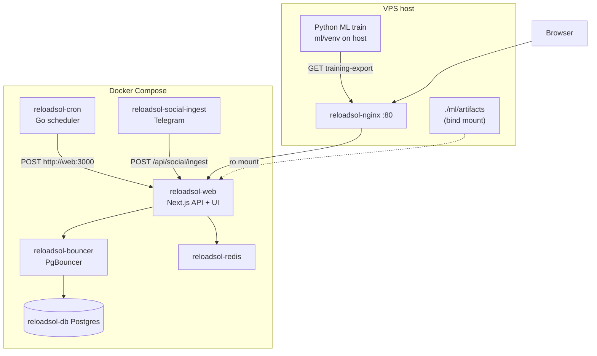
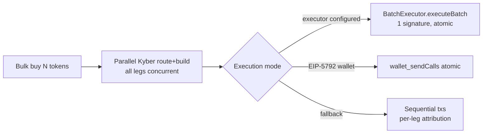
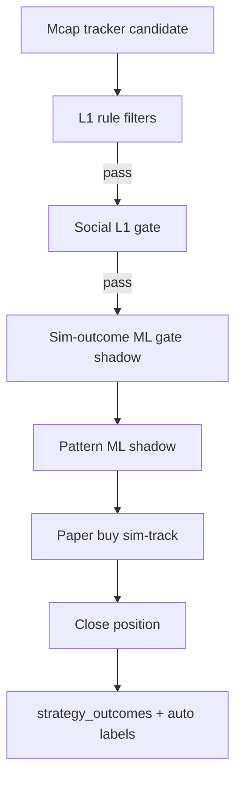
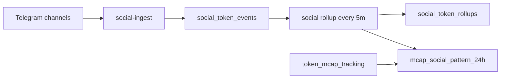

# ReloadSOL — Architecture Summary

Single-page overview: what the system does, how dual-chain trading + algo + social + ML fit together, and what to do next.

Related deep dives: [DECISION_MACHINE.md](./DECISION_MACHINE.md) (Solana + RH algo current state), [architecture.md](./architecture.md), [algo_overview.md](./algo_overview.md), [ML_GATE_PLAN.md](./ML_GATE_PLAN.md), [OPERATOR_STATE.md](./OPERATOR_STATE.md), [recommendations.md](../recommendations.md) (2026-07 infra audit, file:line evidence).

---

## 1. Main function

**ReloadSOL** is a **dual-chain** memecoin trading platform:

- **Solana mainnet** — bulk buys via Raptor/Jupiter, trending + mcap strategies, Meteora DLMM agent, server keypair execution
- **Robinhood Chain (EVM id 4663)** — bulk buys via Kyber + **BatchExecutor contract** (1 signature = wrap + Permit2 + N swaps, atomic), Uni v3/v4-fork CLMM positions, browser (Rabby) or bound-GMGN wallet modes

Combined with:

- **Manual trading** — bulk buy/sell, swaps, PnL tracking, wallet ops on both chains
- **Automated strategies** — trending bot, signals paper trading, DLMM/CLMM liquidity agents
- **Research loop** — paper sims → labeled outcomes → ML shadow scoring → (future) enforce gates

**North star:** strict checker over brilliant maker. Primary thesis is **`mcap_enter_at_80`** paper sim at the 80% mcap milestone; **Pattern ML** (24h cohort labels) is the primary ML focus.

**Data layer:** Docker Postgres **`reloadsol_db`** only. Supabase is **cut off**. Schema source: [`db/init/`](../db/init/) (`02-schema.sql` + migrations `04`–`29`; **25** adds RH CLMM `pool_key`/`fee`/`tick_spacing`; **29** chain-scopes DLMM candidates/positions + FOMO trader/closed tables). [`supabase/schema.sql`](../supabase/schema.sql) is a legacy mirror.

Related: [GMGN_STRATEGY.md](./GMGN_STRATEGY.md) (Radar live thread + comeback).

### Runtime stack (Docker on server)



| Service | Role |
|---------|------|
| **web** | Next.js App Router, ~50+ API routes, strategy admin, sim-track, ONNX shadow scorers |
| **cron** | Go worker scheduler (trending, sim-track, social rollup, DLMM, **`rh_lp_screen`**, **`strategy_search`**, **`fomo_ws`**, **`rh_clmm_manage`**, etc.) |
| **nginx** | Public HTTP :80 → web (prod hides web :3000 from host) |
| **postgres + pgbouncer** | All app data; init from `db/init/*.sql` |
| **redis** | Caches (RH CLMM pool-state 15s TTL, live tiers), job locks, alert throttles |
| **social-ingest** | Telethon sidecar → Telegram mentions/wallet buys → API |
| **host ML** | LightGBM train/export **not** in containers; ONNX mounted into web |

**Security:** all Go `/trigger/*` endpoints require header **`X-Trigger-Secret`** (env `TRIGGER_SECRET`, falls back to `TRENDING_TRACKER_SECRET`); `/health`, `/status`, `/workers` stay public. Internal caller: `/api/workers/trigger` sends it automatically.

**Important:** On prod, API calls from the host use `API_BASE_URL=http://127.0.0.1` (nginx), not `localhost:3000`.

---

## 2. Dual-chain architecture

**"Robinhood Ethereum" = Robinhood Chain**, an EVM chain (id **4663**, native ETH) with Uni **v3 + v4 forks** (PoolManager/PositionManager/StateView), canonical **Permit2** `0x0000…8BA3`, WETH `0x0Bd7…AD73`, USDG; Kyber aggregator slug `robinhood`; Blockscout explorer. Not a brokerage API, not mainnet.

### Separation model

- **Client:** `AppNetwork = 'sol' | 'robinhood'` in localStorage ([`app-network.ts`](../src/utils/app-network.ts)); route gating via `routeSupportsNetwork` ([`route-network.ts`](../src/config/route-network.ts)).
- **API:** `rejectWrongNetwork(req, 'robinhood')` on RH routes; `parseDbChain` on shared routes.
- **DB:** `chain` column on `trading_records`/`strategy_outcomes`; RH CLMM has its own ledger tables ([`rh-clmm-db.ts`](../src/utils/dlmm/rh-clmm-db.ts)) with `pool_key`/`fee`/`tick_spacing` (migration 25) so reads skip fee/spacing discovery.
- **Chain constants:** fully isolated in [`rh-clmm/config.ts`](../src/utils/dlmm/rh-clmm/config.ts).
- **Strategies:** registry carries `chain` + `execution_mode`; chain-scoped sim wallets; **shared exit ladder** ([`exit-ladder.ts`](../src/strategies/exit-ladder.ts)) used by both Solana and RH cycles (Solana TP3 = trailing-after-TP1; RH TP3 = profit target — both semantics preserved).
- **Known leak (Phase 2 backlog, REL-1):** RH sim ledger reuses `solAmount`/`totalSolBought` columns to carry ETH — treat as "native amount".

### RH trade execution (fast batch path)



- **Quotes:** all Kyber `/routes` then all `/builds` fire concurrently (was sequential per leg).
- **Approvals:** Permit2 pattern — one-time ERC20 approve to canonical Permit2 + `permit2.approve(token, spender, …)`; flag `RH_PERMIT2_SWAPS` (default **off** until Kyber Permit2-pull validated).
- **BatchExecutor** ([`contracts/src/BatchExecutor.sol`](../contracts/src/BatchExecutor.sol)): owner-scoped, immutable, atomic `executeBatch(Call[])` — WETH wrap → Permit2 pulls → router approvals → N swaps → dust sweep. Pausable; sweeps work while paused. 10/10 Foundry tests incl. fork vs real Permit2/WETH on 4663. Enabled via `RH_BATCH_EXECUTOR_ADDRESS` (unset = legacy behavior unchanged). Precedence: **executor → 5792 → sequential**.
- **Per-leg attribution:** sequential mode reports per-leg success/hash (`RhSequentialWriteError` carries call index); executor/5792 modes are atomic (one hash).
- Chain 4663 block time ≈ **0.1s** → 10-token batch ≈ **1 signature, ~3–5s end-to-end** (quote + sign + 1 block).

### CLMM/DLMM lifecycle

| Step | Solana (Meteora DLMM) | Robinhood (v3/v4 fork) |
|------|----------------------|------------------------|
| Open | `deployPosition` (server keypair, automated) | `mintV4SingleSided` (browser batch: wrap + Permit2 + mint; pool_key persisted) |
| View | agent ledger + on-chain | `listV4Positions` — **3 Multicall3 batches** (was ~8 sequential RPC reads/NFT); Redis slot0 cache 15s |
| Fees | **auto-claim in manage cycle** (`DLMM_AUTO_CLAIM_FEE_SOL`, default 0.005 SOL) | manual `claimV4Fees`; alerts via `rh_clmm_manage` (`RH_CLMM_FEE_ALERT_USD`, default $5) |
| Rebalance | **real REDEPLOY** (remove + re-deploy ±`bin_range_interval`, mirrors `editPosition`) | not yet — alert-only OOR Telegram (Phase 2: active mode once server signer exists) |
| Exit | `removePosition` + outcome write (ML entry features) | `closeV4Position` (3 encoded strategies, simulated then written) |

- **Manage cycles:** Solana `dlmm_manage` (60s) — unique pools fetched once per cycle (batched). RH `rh_clmm_manage` (300s, **alert-only**, read-only) — OOR + fee-threshold Telegram alerts, 1h per-position throttle, Multicall3-batched reads, `DLMM_MANAGE_SECRET` + job lock.

---

## 3. Algo (rules, workers, data)

### Strategy domains

| Domain | UI | Worker | Outcomes on close |
|--------|-----|--------|-------------------|
| **trending_bot** | `/dev/algo-tester`, `/dev/strategies` | `POST /api/trending/track` (~5m) | `recordTrendingBotOutcome` |
| **signals** | `/dev/signals` | `POST /api/signals/sim-track` (~120s) | `recordSignalsOutcome` |
| **dlmm** | `/dev/dlmm` | screen + manage cron | `recordDlmmOutcome` |
| **mcap_tracker** | mcap sim strategies | `POST /api/mcap-tracking/sim-track` | `recordMcapTrackerOutcome` |
| **rh CLMM** | `/dev/dlmm` (RH tabs) | `rh_clmm_manage` (alert-only) | ledger (live outcomes pending active mode) |

Config: [`src/strategies/registry.ts`](../src/strategies/registry.ts) + `strategy_definitions` DB overrides (incl. RH `max_open_positions`, mcap bands — DB-tunable since 2026-07). Admin: `/dev/strategies`.

Execution modes: `sim_only` | `live_only` | `ab_parallel`. RH strategy `att_rh` is **`sim_only`** until a server signer (hot EOA or ERC-4337 session keys) lands (REL-8/REL-9).

### Entry pipeline (mcap sim — primary ML path)



**L1 rules** ([`mcap-sim-track.ts`](../src/utils/mcap-sim-track.ts)): mcap band, milestone entry, rug list, max open positions, duplicate guards.

**Social L1** ([`social-snapshot.ts`](../src/strategies/social-snapshot.ts)): min mentions 30m, smart-wallet buy, staleness — shadow mode can log without blocking.

**Social ingest → rollups → patterns**



- **Rollups:** per-token mention counts, channels, smart-wallet buys (powers social gates + ML features).
- **24h patterns:** tokens with `first_seen_at` in last 24h — winner ≥120% growth, loser <80%, neutral not stored.
- UI: `/dev/social` → **24h Patterns**; auto-refresh via social rollup cron.

### Key tables

| Table | Purpose |
|-------|---------|
| `token_mcap_tracking` | Live mcap milestones, growth % |
| `social_token_events` / `social_token_rollups` | Raw + aggregated social metrics |
| `mcap_social_pattern_24h` | Winner/loser cohort snapshots for pattern ML |
| `strategy_outcomes` | Closed trades + entry features + ML labels |
| RH CLMM ledger tables | v3/v4 positions incl. `pool_key` (migration 25) |
| `market_regime_tags` | Daily regime for L3 / reporting |

### Cron workers (Go → web API)

Examples: `trending_track`, `signals_sim_track`, `mcap_tracker_sim_open`, `mcap_tracker_sim_track`, `social_rollup` (300s), `social_wallet_poll`, DLMM screen/manage, **`rh_clmm_manage`** (300s, alert-only). All `/trigger/*` need `X-Trigger-Secret`.

Workers tab: `/dev/strategies` → Workers (needs `CRON_SERVICE_URL`).

---

## 4. ML

**Primary focus: Pattern ML (Track B).** Sim-outcome gate (Track A) is secondary.

### Track B — Pattern gate (24h mcap + social cohorts) — PRIMARY

| Item | Detail |
|------|--------|
| Labels | `pattern_class`: winner=1, loser=0 from `mcap_social_pattern_24h` |
| Features | [`pattern-features.ts`](../src/strategies/social/pattern-features.ts): log first mcap, mentions/channels 30m, minutes to first mention, wallet buys, GMGN FOMO flag |
| Train (host) | `API_BASE_URL=http://127.0.0.1 npm run ml:export-patterns && npm run ml:train-pattern` |
| Validation | **train/valid/test 3-way split (time-ordered); threshold tuned on valid only, test untouched** (leak fixed 2026-07) |
| Meta metrics | macro-F1 + **PR-AUC, winner P/R/F1, valid macro-F1, per-feature coverage report** |
| Artifacts | `ml/artifacts/pattern-gate/model.onnx` + `model.meta.json` |
| Runtime | [`entry-pattern-scorer.server.ts`](../src/strategies/entry-pattern-scorer.server.ts) |
| Enforce | `ML_PATTERN_MODE=enforce` only when `pattern_ready` (macro-F1 ≥ 0.60) |
| **Baseline** | macro-F1 **0.468**, class-1 recall **0**, train `{0:280, 1:50}` → **shadow only** — class imbalance is the blocker (Phase 3: cohort expansion + social-at-entry snapshots) |

### Track A — Sim-outcome gate (Layer 2) — secondary

| Item | Detail |
|------|--------|
| Labels | `training_class` 0–4 from closed PnL; `gate_class` binary for v2-gate |
| Validation | `carve_valid()` — early stopping no longer watches test (fixed 2026-07) |
| Train | `npm run ml:export` → `ml:train-gate` / `ml:train-potential` |
| Runtime | [`entry-ml-scorer.server.ts`](../src/strategies/entry-ml-scorer.server.ts) |
| Enforce | `ML_GATE_MODE=enforce` only when `gate_ready` (macro-F1 ≥ 0.65) |

### ML training rules (both tracks)

- Train on **host**, not in web/cron containers; redeploy web after new ONNX (ro mount).
- Default **shadow**; never enforce live capital when `*_ready` fails.
- Export now logs **feature coverage** (`featureCoverage` in training-export response; `feature_coverage` in meta) to catch missing social features early.

---

## 5. Status & next steps

### Phase 1 — shipped 2026-07 (see [recommendations.md](../recommendations.md) §9)

Parallel Kyber route+build + per-leg tracking · pool_key ledger (migration 25) · Multicall3 v4 reads + Redis slot0 cache · real Solana REDEPLOY + Meteora auto-fee-claim · `rh_clmm_manage` alert worker · ML valid-split + honest metrics + coverage logging · shared exit ladder + RH sim O(n²)→O(n) + DB-tunable caps · `X-Trigger-Secret` auth.

**Before deploy:** `go build ./...` (Go changes compile-unverified locally) · apply migration 25 · set `TRIGGER_SECRET` (or rely on fallback) · note docs' bare `curl /trigger/*` examples now need the header.

### Phase 2 — structural (in progress)

| Item | Status |
|------|--------|
| BatchExecutor contract (REL-6) | **Code complete** — 10/10 Foundry tests incl. fork; **deploy pending** (`forge script script/Deploy.s.sol:Deploy --broadcast`, then set `RH_BATCH_EXECUTOR_ADDRESS`) |
| Permit2 swap path (REL-7) | **Code complete** behind `RH_PERMIT2_SWAPS` (default off) |
| Trending monolith split + batched DB writes (REL-19/20) | Planned |
| RH live execution: hot EOA vs ERC-4337 session keys (REL-8/9) | Decision pending → then `att_rh` graduates from `sim_only` behind flag |
| RH CLMM active manage (auto-claim/close) (REL-12) | After server signer |
| Dedicated RH RPC + health panel (REL-37/4) | Planned |
| Chain-ledger nativeAmount rename (REL-1) | Planned |

### Phase 3 — ML enforcement readiness (data-gated)

1. Keep `ML_PATTERN_MODE=shadow`; expand winner cohort (48–72h window, ordinal labels) + social-at-entry snapshots.
2. Calibration + written enforce criteria; weekly shadow-vs-cohort review.
3. Daily retrain cron with artifact quality gate (`scripts/install-ml-pattern-cron.sh`).
4. Enforce on **sim** first (`ab_parallel`), never directly on live capital.

### Quick command reference (server)

```bash
# Pattern ML
export API_BASE_URL=http://127.0.0.1
export TRENDING_TRACKER_SECRET=...
npm run ml:export-patterns && npm run ml:train-pattern
npm run docker:deploy:web

# Trigger a worker (auth required)
curl -X POST -H "X-Trigger-Secret: $TRIGGER_SECRET" http://127.0.0.1:8080/trigger/rh-clmm-manage

# Health
curl -s http://127.0.0.1/api/mcap-patterns/stats | jq
curl -s http://127.0.0.1/api/strategies/ml/dataset-stats?domain=mcap_tracker | jq

# DB cohort counts
docker exec reloadsol-db psql -U reloadsol -d reloadsol_db -c \
  "SELECT cohort, COUNT(*) FROM mcap_social_pattern_24h GROUP BY cohort;"
```

---

## Document map

| Doc | Use when |
|-----|----------|
| [recommendations.md](../recommendations.md) | 2026-07 infra audit — all findings + phases, file:line evidence |
| [handoff.md](../handoff.md) | Session handoff — Pattern ML ops checklist |
| [ARCHITECTURE_SUMMARY.md](./ARCHITECTURE_SUMMARY.md) | This page — whole picture |
| [algo_overview.md](./algo_overview.md) | Workers, outcomes, gap diagnosis |
| [ML_GATE_PLAN.md](./ML_GATE_PLAN.md) | Layer 2/3 ML phases |
| [OPERATOR_STATE.md](./OPERATOR_STATE.md) | Live ops, retrain loops, constraints |
| [contracts/README.md](../contracts/README.md) | BatchExecutor build/test/deploy/verify |
| [ml/README.md](../ml/README.md) | Python setup, train commands |
