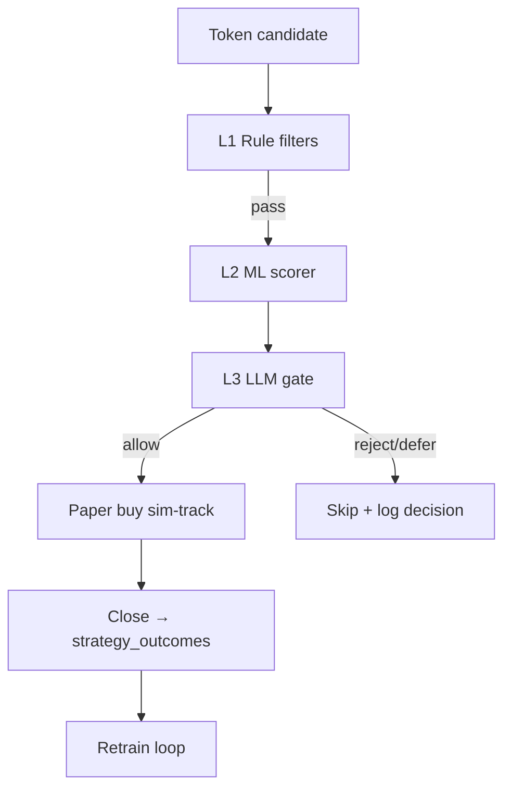

# ML Gate Plan — Layer 2 (ML) → Layer 3 (LLM) → Paper Trading

Three-layer entry gating for memecoin strategies: **rule filters (L1, done)** → **LightGBM confidence (L2)** → **regime-aware LLM gate (L3)** → **paper validation before live capital**.

See also: [STRATEGY_ARCHITECTURE.md](./STRATEGY_ARCHITECTURE.md), [algo_overview.md](./algo_overview.md).

---

## Architecture



**Principle:** rules stay hard gates (rug, range, holders). ML ranks survivors. LLM adds regime/context on top — never replaces safety rules.

---

## Current state (Layer 1)

| Layer | Status | Location |
|-------|--------|----------|
| L1 Rules | Done | `getMcapSimOpenSkipReason()` in `mcap-sim-track.ts` |
| Entry features | Done | `buildEntryFeatureSnapshot()` |
| Auto labels | Done | `computeTrainingClass()` — tiers 0–4 by PnL band (see below) |
| Training data | Done | `strategy_outcomes`, CSV export |
| Regime tags | Done | `market_regime_tags` → `regime_tag_at_exit` |
| Paper trading | Done | `POST /api/mcap-tracking/sim-track`, `POST /api/signals/sim-track` |
| LLM pattern | Done | `src/utils/dlmm/reasoner.ts` (rule fallback + optional HTTP LLM) |

---

## Implementation phases

| Phase | Scope | Status |
|-------|-------|--------|
| **0** | Dataset readiness API, tier labels 0–4, backfill, export | **Done** |
| **1** | Python multiclass train pipeline (`ml/train.py`), ONNX artifact | **Done** — see `ml/README.md` |
| **2** | ONNX runtime scorer in Node (`entry-ml-scorer.ts`) | Planned |
| **3** | LLM gate (`entry-llm-gate.ts`) + regime prompt | Planned |
| **4** | Sim-track shadow/enforce modes | Planned |
| **5** | Reports + promotion checklist | Planned |

---

## Phase 0 — Data readiness

### Minimum dataset

| Check | Target |
|-------|--------|
| Closed outcomes with `training_class` 0–4 | ≥ **200** (300+ preferred) |
| Balanced tiers | `train_ready === true` (multiple tiers or class 0 + wins) |
| Regime tags | Tag daily in Strategy Admin → Reports |

### Tier labels

| Class | Condition |
|-------|-----------|
| **0** | Lost, negative PnL, or won with PnL < 20% |
| **1** | Won, 20% ≤ PnL < 50% |
| **2** | 50% ≤ PnL < 100% |
| **3** | 100% ≤ PnL < 300% |
| **4** | PnL ≥ 300% |

### Readiness API

```
GET /api/strategies/ml/dataset-stats?domain=mcap_tracker
```

Returns `by_class`, `pnl_buckets`, `labeled`, `train_ready`, and `ready` (labeled ≥ 200).

Backfill stored labels:

```
POST /api/strategies/ml/backfill-labels?dry_run=true&domain=mcap_tracker&key=SECRET
```

### Training export

```
GET /api/strategies/outcomes?format=csv&training_class_only=true&recompute_labels=true&limit=5000
```

Rows with `training_class` ∈ {0,1,2,3,4}. Optional `training_class_min=1` for win tiers only.

### Entry-time features (no leakage)

| Feature | Transform |
|---------|-----------|
| `entry_mcap` | `log1p` |
| `entry_mcap_band` | one-hot (6 bands) |
| `organic_score` | raw |
| `top_holders_pct` | raw |
| `token_age_hours` | raw, cap 168h |
| `volume_at_entry` | `log1p` |
| `entry_template` | binary (`milestone_80` = 1) |

**Exclude from training:** `monitor_snapshots`, exit mcap/growth, `pnl_pct`, `regime_tag_at_exit` (regime is L3 only).

Shared spec: `src/strategies/ml-training-features.ts` and `ml/features.py`.

---

## Phase 1 — Train LightGBM

See [`ml/README.md`](../ml/README.md).

```bash
cd ml && python -m venv venv && source venv/bin/activate
pip install -r requirements.txt

# Export (from running app or CSV)
python export_training_data.py --source api --domain mcap_tracker --output data/training.parquet

# Check readiness
python check_dataset.py data/training.parquet

# Train → ml/artifacts/v1/
python train.py --input data/training.parquet --version v1
```

Outputs: `model.onnx`, `model.lgb.txt` (fallback), `model.meta.json` (metrics, feature order, `confidence_min`).

---

## Phase 2 — Runtime ML scorer (planned)

- `src/strategies/entry-ml-scorer.ts` — ONNX via `onnxruntime-node`
- Strategy config: `ml.enabled`, `ml.mode` (`off` | `shadow` | `enforce`), `ml.confidenceMin`
- Persist `ml_confidence` on every candidate in shadow mode

---

## Phase 3 — LLM gate (planned)

- `src/strategies/entry-llm-gate.ts` — mirror DLMM reasoner
- Prompt: ML score + entry features + live snapshot + today's `market_regime_tags`
- Output: `allow` | `defer` | `reject`; fallback to ML-only on LLM failure
- Env: `ENTRY_GATE_LLM_API_URL` (or internal `/api/strategies/entry-gate`)

---

## Phase 4 — Paper trading integration (planned)

Hook in `mcap-tracking/sim-track` **after** `shouldOpenMcapSim()`, **before** `openSimPosition()`:

1. `buildEntryFeatureSnapshot()`
2. `scoreEntryFeatures()`
3. `evaluateEntryGate()`
4. Skip with `ml_low_confidence` / `llm_reject` when `enforce`

Rollout: **shadow** (1 week) → counterfactual analysis → **enforce** with conservative threshold.

---

## Phase 5 — Validation & promotion (planned)

| Gate | Requirement |
|------|-------------|
| Paper trades (enforce) | ≥ 100 |
| Win rate / avg PnL | ≥ rules-only baseline |
| Pass rate | Gate blocks < 80% of candidates |
| Rollback | Set `ml.mode=off` |

Live capital: same gate on trending track **only after** mcap_tracker paper proves out.

---

## File map

| Path | Purpose |
|------|---------|
| `docs/ML_GATE_PLAN.md` | This document |
| `ml/README.md` | Train/export quick start |
| `ml/train.py` | LightGBM + ONNX export |
| `ml/export_training_data.py` | Pull training parquet |
| `ml/check_dataset.py` | Local readiness check |
| `ml/features.py` | Feature engineering (mirrors TS) |
| `src/strategies/ml-training-features.ts` | TS feature spec + dataset stats |
| `src/app/api/strategies/ml/dataset-stats/route.ts` | Readiness API |

---

## Risks

| Risk | Mitigation |
|------|------------|
| Too few labels | Keep sim-track running; defer enforce until 200+ |
| Overfit | Time-based train/test split (by `entry_at`) |
| LLM cost/latency | Only call when ML ≥ `confidenceMin` |
| Feature drift | Log distributions weekly in shadow mode |
