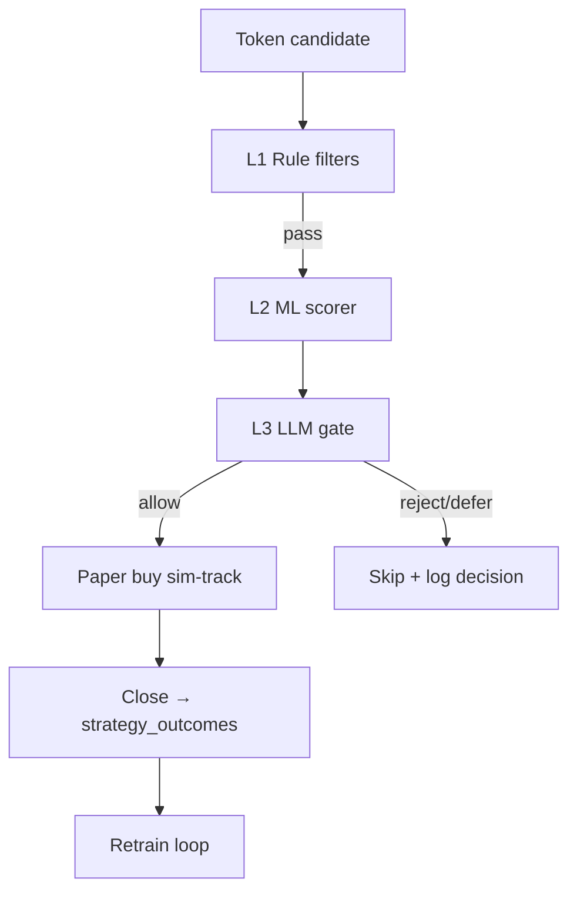

# ML Gate Plan — Layer 2 (ML) → Layer 3 (LLM) → Paper Trading

> **Note (Jul 2026):** Primary ML focus is **Pattern ML** (24h mcap + social cohort labels). See [ARCHITECTURE_SUMMARY.md](./ARCHITECTURE_SUMMARY.md) and [OPERATOR_STATE.md](./OPERATOR_STATE.md). This document covers the **sim-outcome gate** (Layer 2 secondary track) and planned LLM gate (Layer 3).

Three-layer entry gating for memecoin strategies: **rule filters (L1, done)** → **LightGBM confidence (L2)** → **regime-aware LLM gate (L3)** → **paper validation before live capital**.

See also: [STRATEGY_ARCHITECTURE.md](./STRATEGY_ARCHITECTURE.md), [algo_overview.md](./algo_overview.md).

---

## Architecture



**Principle:** rules stay hard gates (rug, range, holders). ML ranks survivors. LLM adds regime/context on top — never replaces safety rules.

---

## Operator alerts (two-stage copy trade)

Separate from ML gating — notifications for **manual copy trading**.

- **Pattern ML** (`ML_PATTERN_MODE=shadow` default) scores candidates on sim-track entry; it does **not** drive UI toasts.
- **Stage 1 — Early Enter:** when Signals scores `enter` and growth &lt; 100% (`signals-early-alerts` + `sendSignalsEarlyEnterAlert`). Earliest actionable alert; does **not** open a sim position.
- **Stage 1 Pattern ML shadow:** same request scores Pattern ML (`p_winner`) for display on Telegram / toast / Signals **ML** column. **Never gates** Stage-1 until `pattern_ready` + explicit enforce wiring.
- **Stage 2 — Sim open:** when `mcap_enter_first_seen` / `mcap_enter_at_80` paper-open succeeds (`mcap-sim-open-alerts` + `sendMcapSimManualTradeAlert`). Confirm after gates.
- **Layer 2 sim-outcome ML gate** = entry filter (reject bad candidates). Alerts = operator notification only (not auto-buy).
- UI: app-wide toast host polls `GET /api/mcap-tracking/sim-open-alerts` every 15s; top-right with Buy. Telegram when `TELEGRAM_BOT_TOKEN` + `TELEGRAM_ALERT_CHAT_ID` are set.

---

## Current state (Layer 1)

| Layer | Status | Location |
|-------|--------|----------|
| L1 Rules | Done | `getMcapSimOpenSkipReason()` in `mcap-sim-track.ts` |
| Entry features | Done | `buildEntryFeatureSnapshot()` |
| Auto labels | Done | `computeTrainingClass()` — tiers 0–4 by PnL band (see below) |
| Training data | Done | `strategy_outcomes`, CSV export |
| Regime tags | Done | `market_regime_tags` → `regime_tag_at_exit` |
| Paper trading | Done | `POST /api/mcap-tracking/sim-track`, `POST /api/signals/sim-track` |
| LLM pattern | Done | `src/utils/dlmm/reasoner.ts` (rule fallback + optional HTTP LLM) |

---

## Implementation phases

| Phase | Scope | Status |
|-------|-------|--------|
| **0** | Dataset readiness API, tier labels 0–4, backfill, export | **Done** |
| **1** | Two-stage train (`gate` + `potential`), export v2 columns | **Done** — see `ml/README.md` |
| **2** | ONNX runtime scorer in Node (`entry-ml-scorer.ts`) | **Done** (shadow) |
| **3** | LLM gate (`entry-llm-gate.ts`) + regime prompt | Planned |
| **4** | Sim-track enforce mode | Shadow default; enforce wired (`ML_GATE_MODE=enforce` + `gate_ready`) |
| **5** | Reports + promotion checklist | Planned |

---

## Phase 0 — Data readiness

### Minimum dataset

| Check | Target |
|-------|--------|
| Closed outcomes with `training_class` 0–4 | ≥ **200** (300+ preferred) |
| Balanced tiers | `train_ready === true` (multiple tiers or class 0 + wins) |
| Regime tags | Tag daily in Strategy Admin → Reports |

### Tier labels

| Class | Condition |
|-------|-----------|
| **0** | Lost, negative PnL, or won with PnL < 20% |
| **1** | Won, 20% ≤ PnL < 50% |
| **2** | 50% ≤ PnL < 100% |
| **3** | 100% ≤ PnL < 300% |
| **4** | PnL ≥ 300% |

### Readiness API

```
GET /api/strategies/ml/dataset-stats?domain=mcap_tracker
```

Returns `by_class`, `pnl_buckets`, `labeled`, `train_ready`, and `ready` (labeled ≥ 200).

Backfill stored labels (run once after tier scheme deploy, or when old rows show "—" in Strategy Admin):

```bash
npm run ml:backfill-labels -- --dry-run
npm run ml:backfill-labels
```

Or `POST /api/strategies/ml/backfill-labels?dry_run=true&domain=mcap_tracker&key=SECRET` — see [`ml/README.md`](../ml/README.md).

### Training export

```
GET /api/strategies/outcomes?format=csv&training_class_only=true&recompute_labels=true&limit=5000
```

Rows with `training_class` ∈ {0,1,2,3,4}. Optional `training_class_min=1` for win tiers only.

### Entry-time features (no leakage)

| Feature | Transform |
|---------|-----------|
| `entry_mcap` | `log1p` |
| `entry_mcap_band` | one-hot (6 bands) |
| `organic_score` | raw |
| `top_holders_pct` | raw |
| `token_age_hours` | raw, cap 168h |
| `volume_at_entry` | `log1p` |
| `entry_template` | binary (`milestone_80` = 1) |

**Exclude from training:** `monitor_snapshots`, exit mcap/growth, `pnl_pct`, `regime_tag_at_exit` (regime is L3 only).

Shared spec: `src/strategies/ml-training-features.ts` and `ml/features.py`.

---

## Phase 1 — Train LightGBM (two-stage v2)

See [`ml/README.md`](../ml/README.md).

**Stage A — Gate (binary):** `gate_class` 0 = skip tier (loss or win &lt; 20%), 1 = allow (win ≥ 20%).

**Stage B — Potential (tiers 1–4):** trained on `gate_class === 1` rows only; predicts upside bucket.

Legacy 5-class `training_class` export/train still supported via `--stage multiclass`.

```bash
npm run ml:export
npm run ml:train-gate
npm run ml:train-potential
npm run ml:check-dataset
```

Artifacts:

- `ml/artifacts/v2-gate/` — binary gate (enforce candidate)
- `ml/artifacts/v2-potential/` — tier model (advisory only for now)

---

## Phase 2 — Runtime ML scorer (shadow live)

**Status:** Shadow scoring on `mcap-tracking/sim-track` opens — trades are **never** blocked yet.

**Checker/maker decoupling:** The ONNX scorer (checker) receives only raw entry features from `ml-training-features.ts` — never strategy scores, weights, or rationale. Strategy logic (maker) stays in registry + assign; the verifier must remain blind to those to avoid verification rot.

**Implementation:**

- [`src/strategies/entry-ml-scorer.ts`](../src/strategies/entry-ml-scorer.ts) — dual ONNX (gate + potential) via `onnxruntime-node`
- [`src/strategies/ml-shadow-log.ts`](../src/strategies/ml-shadow-log.ts) — persists shadow fields on `entry_features`
- Env: `ML_GATE_ARTIFACT_DIR`, `ML_POTENTIAL_ARTIFACT_DIR`, `ML_GATE_MODE=shadow|enforce|off` (default **shadow**), `ML_GATE_P_BAD_MAX` (default **0.5**)

**Shadow fields on buy `entry_features`:**

| Field | Meaning |
|-------|---------|
| `ml_gate_p_bad` | P(gate class 0) |
| `ml_gate_predicted` | 0 or 1 |
| `ml_potential_tier` | Predicted tier 1–4 (advisory) |
| `ml_potential_moon_score` | P(tier≥3) |
| `ml_shadow_at` | ISO timestamp |

**Drift / verification rot:** Weekly (or after ≥50 new outcomes):

```bash
npm run ml:export
npm run ml:check-dataset
npm run ml:check-potential
```

Reject live gating when `model.meta.json` → `metrics.gate_ready` is false (gate macro-F1 &lt; 0.65). v1 multiclass is deprecated for gating. See [`docs/OPERATOR_STATE.md`](OPERATOR_STATE.md).

---

## Phase 3 — LLM gate (planned)

- `src/strategies/entry-llm-gate.ts` — mirror DLMM reasoner
- Prompt: ML score + entry features + live snapshot + today's `market_regime_tags`
- Output: `allow` | `defer` | `reject`; fallback to ML-only on LLM failure
- Env: `ENTRY_GATE_LLM_API_URL` (or internal `/api/strategies/entry-gate`)

---

## Phase 4 — Paper trading integration

Shadow hook is live in `mcap-tracking/sim-track` (scores every open candidate).

**Enforce (wired, off by default):**

1. Set `ML_GATE_MODE=enforce` only after `metrics.gate_ready === true` and 200+ labeled closes reviewed
2. Skip when `ml_gate_p_bad > ML_GATE_P_BAD_MAX` (default 0.5) — skip reason `ml_gate_reject`
3. Counterfactual log: `[ml-gate:counterfactual]` on rejected-would-be trades
4. Potential model remains advisory only

---

## Phase 5 — Validation & promotion (planned)

| Gate | Requirement |
|------|-------------|
| Paper trades (enforce) | ≥ 100 |
| Win rate / avg PnL | ≥ rules-only baseline |
| Pass rate | Gate blocks < 80% of candidates |
| Rollback | Set `ml.mode=off` |

Live capital: same gate on trending track **only after** mcap_tracker paper proves out.

---

## File map

| Path | Purpose |
|------|---------|
| `docs/ML_GATE_PLAN.md` | This document |
| `ml/README.md` | Train/export quick start |
| `ml/train.py` | LightGBM + ONNX (`--stage gate|potential|multiclass`) |
| `src/strategies/outcome-labeling.ts` | `computeGateClass`, `computePotentialTier` |
| `src/strategies/entry-ml-scorer.ts` | ONNX shadow scorer (gate + potential) |
| `src/strategies/ml-shadow-log.ts` | Merge shadow fields into `entry_features` |
| `ml/export_training_data.py` | Pull training parquet |
| `ml/check_dataset.py` | Local readiness check |
| `ml/features.py` | Feature engineering (mirrors TS) |
| `src/strategies/ml-training-features.ts` | TS feature spec + dataset stats |
| `src/app/api/strategies/ml/dataset-stats/route.ts` | Readiness API |

---

## Risks

| Risk | Mitigation |
|------|------------|
| Too few labels | Keep sim-track running; defer enforce until 200+ |
| Overfit | Time-based train/test split (by `entry_at`) |
| LLM cost/latency | Only call when ML ≥ `confidenceMin` |
| Feature drift | Log distributions weekly in shadow mode |
