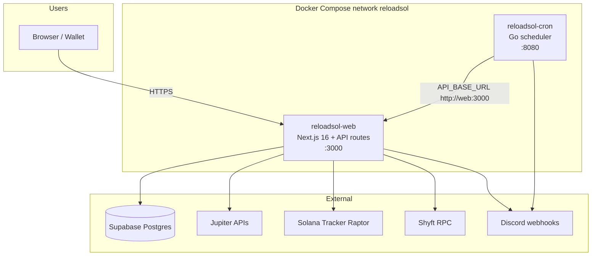
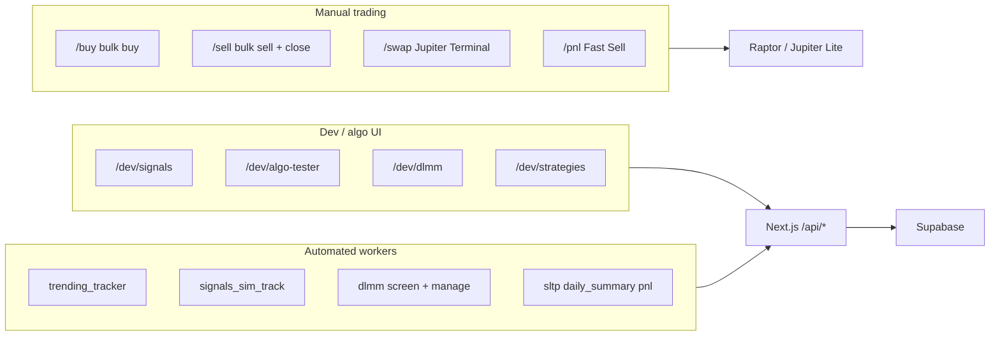
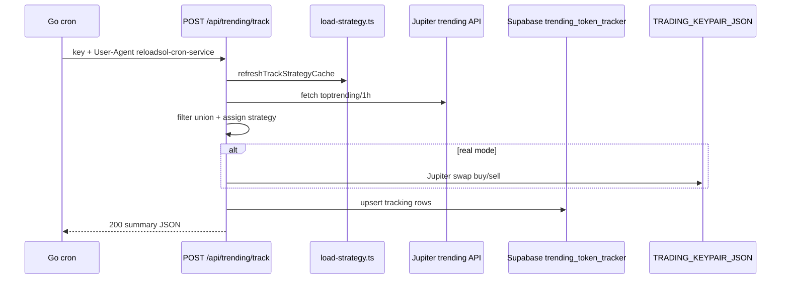

# ReloadSOL Architecture

System-wide architecture for the ReloadSOL platform: deployment topology, product domains, cron workers, data layer, API access, and external dependencies.

Related docs:

- [whole_process.md](./whole_process.md) — manual buy/sell/close flows
- [algo_overview.md](./algo_overview.md) — strategy domains, outcomes, worker ops
- [STRATEGY_ARCHITECTURE.md](./STRATEGY_ARCHITECTURE.md) — strategy registry detail
- [API_ARCHITECTURE_SUMMARY.md](./API_ARCHITECTURE_SUMMARY.md) — API route catalog

---

## 1. System topology

ReloadSOL is a **two-container** stack plus **Supabase Postgres**:

| Component | Image / process | Role |
|-----------|-----------------|------|
| **web** | `Dockerfile.web` → `reloadsol-web` | Next.js App Router, ~50 API routes, SSR UI |
| **cron** | `Dockerfile.cron` → `reloadsol-cron` | Go cron + `/trigger/*` + worker telemetry |
| **Supabase** | Hosted Postgres | Persistence, strategy outcomes, tracking tables |

**Critical wiring**

- Cron calls Next.js at `API_BASE_URL` (compose default: `http://web:3000`).
- Workers UI reads cron at `CRON_SERVICE_URL`. Inside the **web** container, use `http://cron:8080`, not `127.0.0.1:8080`.
- `npm run dev` alone does **not** run cron — use `npm run docker:dev:full` or `docker:up:cron`.

---

## 2. Product domains

The app has three layers that share Supabase and wallet infrastructure but differ in execution model.

### 2.1 Manual trading (wallet-signed)

User connects wallet; swaps execute client-side or via Raptor proxies.

| Route | Stack | Doc |
|-------|-------|-----|
| `/buy`, `/sell` | Solana Tracker Raptor bulk | [whole_process.md](./whole_process.md) |
| `/dev/signals` Live/Board tabs | Jupiter Lite + Raptor mix | same |
| `/chart/[mint]` | Raptor single buy + GMGN chart | same |
| `/pnl` Fast Sell | Raptor + Jupiter reclaim close | same |
| `/swap` | Jupiter Terminal widget | same |

### 2.2 Algo automation (server cron)

Go cron triggers Next.js maintenance endpoints on a schedule. See [algo_overview.md](./algo_overview.md).

| Domain | Primary API | Strategy IDs |
|--------|-------------|--------------|
| **trending_bot** | `POST /api/trending/track` | `att`, `lowcap_moonbag`, `scalper`, `hodl` |
| **signals** | `POST /api/signals/sim-track` | `signals_default`, `signals_sell_over_100` |
| **dlmm** | `POST /api/dlmm/screen`, `/manage` | `dlmm_default` |

Outcomes land in `strategy_outcomes` only on **full position close**.

### 2.3 Admin / observability

| Route | Purpose |
|-------|---------|
| `/dev/strategies` | Config, Reports (coverage + outcomes), **Workers** tab |
| `/dev/algo-tester` | Trending bot dashboard, manual track test |
| `/dev/dlmm` | DLMM candidates, positions, agent config |

---

## 3. Cron workers (11 jobs)

Registered in [`worker_tracker.go`](../worker_tracker.go), scheduled in [`main.go`](../main.go).

| ID | Schedule | Calls | Domain |
|----|----------|-------|--------|
| `signals_sim_track` | every 120s (env) | `POST /api/signals/sim-track` | algo |
| `signals_refresh` | every 60s | `GET /api/trading/signals` | algo |
| `trending_tracker` | every 5m | `POST /api/trending/track` | algo |
| `filtered_trending` | every 2m | `POST /api/trending/filtered` | algo |
| `unfiltered_trending` | every 2m | `POST /api/trending` | algo |
| `dlmm_screen` | every 300s | `POST /api/dlmm/screen` | algo |
| `dlmm_manage` | every 60s | `POST /api/dlmm/manage` | algo |
| `strategy_report` | daily (0=off) | `POST /api/strategies/report-digest` | algo |
| `sltp_monitor` | every 60s | `GET /api/sl-tp-monitor` | infra |
| `daily_summary` | 00:00 UTC | `POST /api/trending/summary` | infra |
| `pnl_update` | 02:00 UTC | `POST /api/pnl/update` | infra |

**Removed (2026-06):** `ohlc_update`, `price_monitor` — charts use GMGN embed only; inter-cycle price alerts dropped in favor of trending track + SL/TP monitor.

**Worker observability**

- `GET http://cron:8080/workers` — live status, `last_success_at`, `last_error_msg`
- `GET /api/workers/status` — Next.js proxy (needs `CRON_SERVICE_URL=http://cron:8080` in web container)
- `POST /api/workers/trigger` — dev-gated manual run

---

## 4. Request flow: trending tracker

The most complex automation path:

**Auth:** query `?key=TRENDING_TRACKER_SECRET` or cron User-Agent (middleware + route).

**Trading hours:** 16:00–04:00 GMT+7 (returns 403 outside window).

**Inline jobs inside track cycle:** none (daily summary and PnL run via dedicated cron workers only).

---

## 5. API access tiers

Enforced in [`src/utils/api-auth.ts`](../src/utils/api-auth.ts) + [`src/config/api-access.ts`](../src/config/api-access.ts):

| Tier | Who | Examples |
|------|-----|----------|
| **public** | Anyone | `/api/health`, `/api/rpc`, `/api/solprice` |
| **wallet** | Signed wallet session | `/api/buy`, `/api/operations`, `/api/trading/records` |
| **dev** | Whitelisted dev wallets | `/api/signals`, `/api/trending`, `/api/workers`, `/api/strategies` |
| **service** | Cron secrets / bearer / UA | `/api/trending/track`, `/api/signals/sim-track`, `/api/pnl/update` |

Wallet session: `WALLET_SESSION_SECRET` cookie after SIWS-style sign-in.

---

## 6. Data layer (Docker Postgres)

Schema source: [`supabase/schema.sql`](../supabase/schema.sql) (applied via [`db/init/`](../db/init/) on first `docker compose up`).

Stack: `reloadsol-db` (Postgres 16, 1GB cap) → `reloadsol-bouncer` (PgBouncer transaction pool) → Next.js `pg` pool (`DATABASE_URL`).

Migrate from hosted Supabase: `bash scripts/migrate-from-supabase.sh` (pgcopydb, public schema).

### Core trading

| Table | Purpose |
|-------|---------|
| `trading_records` | Per-operation history (manual + bot) |
| `token_operations` | Aggregated PnL per wallet |
| `sl_tp_positions` | Chart/manual SL-TP positions |

### Trending bot

| Table | Purpose |
|-------|---------|
| `trending_token_tracker` | Active/waiting/won/lost tokens (+ `_dev` mirror) |
| `trending_token_summary` | Daily rollup stats |
| `bot_job_locks` | Prevent overlapping track cycles |

Required columns for track route include `volume_5m`, `waiting_started_at`, `trading_simulation`, `price_history` (added via schema patches if missing).

### Strategies

| Table | Purpose |
|-------|---------|
| `strategy_definitions` | Overrides: `is_active`, `execution_mode`, JSON config |
| `strategy_outcomes` | Closed trade results for Reports tab |

### DLMM

| Table | Purpose |
|-------|---------|
| `dlmm_agent_config` | Agent on/off, dry-run |
| `dlmm_candidates` | Screen results |
| `dlmm_positions` | Open LP positions |
| `dlmm_lessons` | Post-mortem notes |

### Legacy / optional

| Table | Notes |
|-------|-------|
| `token_ohlc_bars` | Orphaned after OHLC worker removal; safe to ignore |

---

## 7. Docker deploy model

Selective rebuild via [`scripts/docker-scope.sh`](../scripts/docker-scope.sh):

| Change scope | Command | Rebuilds |
|--------------|---------|----------|
| `src/**` only | `npm run docker:deploy:web` | web |
| `*.go` only | `npm run docker:deploy:cron` | cron |
| Both | `npm run docker:deploy:all` | web + cron |

Default `npm run docker:deploy` uses `--auto` from git diff.

---

## 8. External services

| Service | Used for |
|---------|----------|
| **Solana Tracker Raptor** | Bulk buy/sell, chart buy, PnL fast sell |
| **Jupiter Lite** | Single buy/sell in signals, SL/TP monitor |
| **Jupiter Portfolio** | Wallet token list |
| **Jupiter Ultra Reclaim** | Close empty ATAs after sell |
| **Jupiter trending API** | `datapi.jup.ag` + `api.jup.ag` fallback |
| **Shyft RPC** | On-chain reads/writes via `/api/rpc` |
| **GMGN iframe** | Charts on `/chart`, modals (no swap) |
| **Discord** | Bot alerts, cron operational logs |
| **Telegram** | Optional DLMM alerts |

Env: see [`.env.docker.example`](../.env.docker.example) and README environment table.

---

## 9. Recent improvements (Jun 2026)

| Area | Change |
|------|--------|
| **Workers** | Real `last_success_at` / errors from Go [`worker_tracker.go`](../worker_tracker.go); Workers tab + Run now |
| **PnL cron auth** | Unified `PNL_UPDATE_SECRET` + query key + Bearer in `/api/pnl/update` |
| **Trending track** | Jupiter API fallback mirror; `volume_5m` schema patch on Supabase |
| **Cron slim-down** | Removed `ohlc_update`, `price_monitor` (11 workers) |
| **Charts** | GMGN-only; local OHLC stack removed |
| **Docker** | Selective web/cron rebuild (`docker-scope.sh`, `docker-deploy.sh`) |
| **Strategy reports** | Coverage table, pagination, all 7 strategies in Reports tab |
| **Next.js** | Migrated to 16.x; dev nav focused on Signals, Algo Tester, DLMM |

Trade alerts on `DISCORD_WEBHOOK_AUTO_TRADE` (buys/sells) are separate from list alerts.

**List notification env (Docker `.env`):**

| Variable | Default | Purpose |
|----------|---------|---------|
| `TRENDING_LIST_DISCORD_VIA_CRON` | `true` | Cron POST only; disables route timers + track filtering summary |
| `AUTO_NOTIFICATION_INTERVAL_MS` | `120000` | Unfiltered list dedup cooldown |
| `FILTERED_AUTO_NOTIFICATION_INTERVAL_MS` | `120000` | Filtered list dedup cooldown |

Set `TRENDING_LIST_DISCORD_VIA_CRON=false` for local dev without cron (re-enables route timers).

---

## 10. Recommended next improvements

| Priority | Item | Why |
|----------|------|-----|
| **High** | Set `CRON_SERVICE_URL=http://cron:8080` in compose for web | Done — default in `docker-compose.yml` |
| **High** | Consolidate duplicate PnL paths | Done — removed inline PnL from track; `pnl_update` cron only |
| **Medium** | Consolidate daily summary | Done — `daily_summary` cron only; inline track logic removed |
| **Medium** | Auth on Go `/trigger/*` | Not used — `/trigger/*` open on cron port; rely on network/firewall |
| **Medium** | Discord notification dedup | Done — cron-only list alerts + cooldown dedup; track filtering summary skipped when `TRENDING_LIST_DISCORD_VIA_CRON=true` |
| **Low** | Drop `token_ohlc_bars` table | Orphaned after OHLC removal |
| **Low** | Refresh [Overview.md](./Overview.md) | Still references removed pages (mcap-tracker nav, catch-the-coin) |

---

## 11. File map

| Path | Role |
|------|------|
| `main.go`, `worker_tracker.go` | Go cron service |
| `src/app/api/**` | Next.js API routes |
| `src/strategies/**` | Strategy registry, DB, outcomes |
| `src/utils/jupiter.ts` | Swap/close execution |
| `src/app/api/trending/track/route.ts` | Trending bot brain |
| `src/components/strategies/StrategyAdminHub.tsx` | Admin UI |
| `docker-compose.yml` | Web + cron services |
| `supabase/schema.sql` | Database DDL + patches |
