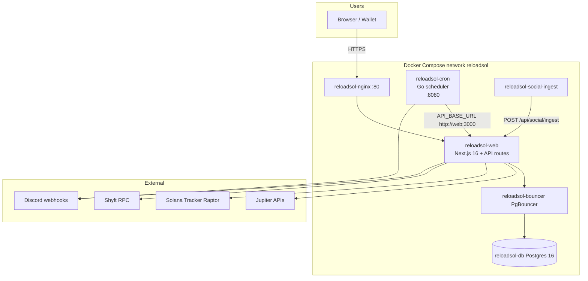
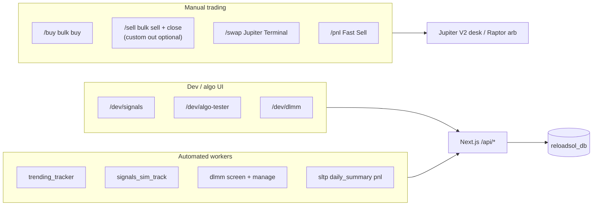
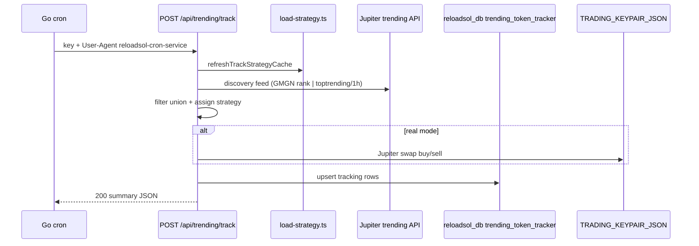

# ReloadSOL Architecture

System-wide architecture for the ReloadSOL platform: deployment topology, product domains, cron workers, data layer, API access, and external dependencies.

Related docs:

- [whole_process.md](./whole_process.md) — manual buy/sell/close flows
- [algo_overview.md](./algo_overview.md) — strategy domains, outcomes, worker ops
- [STRATEGY_ARCHITECTURE.md](./STRATEGY_ARCHITECTURE.md) — strategy registry detail
- [API_ARCHITECTURE_SUMMARY.md](./API_ARCHITECTURE_SUMMARY.md) — API route catalog

---

## 1. System topology

ReloadSOL is a **Docker Compose** stack with **Postgres `reloadsol_db`** (Supabase cut off):


```mermaid
flowchart TB
  subgraph users [Users]
    Browser[Browser / Wallet]
  end

  subgraph docker [Docker Compose network reloadsol]
    Nginx[reloadsol-nginx :80]
    Web[reloadsol-web\nNext.js 16 + API routes]
    Cron[reloadsol-cron\nGo scheduler\n:8080]
    DB[(reloadsol-db Postgres 16)]
    Bouncer[reloadsol-bouncer PgBouncer]
    SocialIngest[reloadsol-social-ingest]
  end

  subgraph external [External]
    Jupiter[Jupiter APIs]
    Raptor[Solana Tracker Raptor]
    Shyft[Shyft RPC]
    Discord[Discord webhooks]
  end

  Browser -->|HTTPS| Nginx --> Web
  Cron -->|API_BASE_URL http://web:3000| Web
  Web --> Bouncer --> DB
  SocialIngest -->|POST /api/social/ingest| Web
  Web --> Jupiter
  Web --> Raptor
  Web --> Shyft
  Web --> Discord
  Cron --> Discord
```

| Component | Image / process | Role |
|-----------|-----------------|------|
| **web** | `Dockerfile.web` → `reloadsol-web` | Next.js App Router, ~50 API routes, SSR UI, ONNX shadow scorers |
| **cron** | `Dockerfile.cron` → `reloadsol-cron` | Go cron + `/trigger/*` + worker telemetry |
| **postgres + pgbouncer** | `reloadsol-db` + `reloadsol-bouncer` | All app data; init from `db/init/*.sql` |
| **social-ingest** | Telethon sidecar | Telegram → `/api/social/ingest` |

**Critical wiring**

- Cron calls Next.js at `API_BASE_URL` (compose default: `http://web:3000`).
- Workers UI reads cron at `CRON_SERVICE_URL`. Inside the **web** container, use `http://cron:8080`, not `127.0.0.1:8080`.
- `npm run dev` alone does **not** run cron — use `npm run docker:dev:full` or `docker:up:cron`.

---

## 2. Product domains

The app has three layers that share Postgres and wallet infrastructure but differ in execution model.


```mermaid
flowchart LR
  subgraph manual [Manual trading]
    Buy["/buy bulk buy"]
    Sell["/sell bulk sell + close\n(custom out optional)"]
    Swap["/swap Jupiter Terminal"]
    PnL["/pnl Fast Sell"]
  end

  subgraph dev [Dev / algo UI]
    Signals["/dev/signals"]
    Algo["/dev/algo-tester"]
    DLMM["/dev/dlmm"]
  end

  subgraph auto [Automated workers]
    Trending[trending_tracker]
    SignalsSim[signals_sim_track]
    DLMMCron[dlmm screen + manage]
    Infra[sltp daily_summary pnl]
  end

  manual --> Raptor[Jupiter V2 desk / Raptor arb]
  dev --> API[Next.js /api/*]
  auto --> API
  API --> Postgres[(reloadsol_db)]
```

### 2.1 Manual trading (wallet-signed)

User connects wallet; desk swaps execute client-side against Jupiter V2 (`/api/jupiter/quote`), with Raptor proxies used for arbitrage.

| Route | Stack | Doc |
|-------|-------|-----|
| `/buy`, `/sell` | Jupiter Swap V2 bulk (Raptor = arb only) | [whole_process.md](./whole_process.md) |
| `/dev/signals` Live/Board tabs | Jupiter V2 (Lite fallback) | same |
| `/chart/[mint]` | Jupiter V2 single buy + GMGN chart | same |
| `/pnl` Fast Sell | Jupiter V2 sell + Jupiter reclaim close | same |
| `/swap` | Jupiter Terminal widget | same |

### 2.2 Algo automation (server cron)

Go cron triggers Next.js maintenance endpoints on a schedule. See [algo_overview.md](./algo_overview.md).

| Domain | Primary API | Strategy IDs |
|--------|-------------|--------------|
| **trending_bot** | `POST /api/trending/track` | `att`, `lowcap_moonbag`, `scalper`, `hodl` |
| **signals** | `POST /api/signals/sim-track` | `signals_default`, `signals_sell_over_100` |
| **mcap_tracker** | `POST /api/mcap-tracking/sim-track` | `mcap_enter_first_seen`, `mcap_enter_at_80` |
| **dlmm** | `POST /api/dlmm/screen`, `/manage` | `dlmm_default` |

Outcomes land in `strategy_outcomes` only on **full position close**.

### 2.3 Admin / observability

| Route | Purpose |
|-------|---------|
| `/dev/algo-tester` | Config (all domains + Workers), Open positions, Closed reports (coverage + outcomes + Review) |
| `/dev/strategies` | Legacy — redirects to `/dev/algo-tester` |
| `/dev/dlmm` | DLMM candidates, positions, agent config |

---

## 3. Cron workers (28 registered; key jobs below)

Registered in [`worker_tracker.go`](../worker_tracker.go), scheduled in [`main.go`](../main.go).

| ID | Schedule | Calls | Domain |
|----|----------|-------|--------|
| `signals_sim_track` | every 120s (env) | `POST /api/signals/sim-track` | algo |
| `signals_refresh` | every 60s | `GET /api/trading/signals` | algo |
| `trending_tracker` | every 5m | `POST /api/trending/track` | algo |
| `unfiltered_trending` | every 2m | `POST /api/trending` | algo |
| `dlmm_screen` | every 300s | `POST /api/dlmm/screen` | algo |
| `dlmm_manage` | every 60s | `POST /api/dlmm/manage` | algo |
| `strategy_report` | daily (0=off) | `POST /api/strategies/report-digest` | algo |
| `report_precompute` | every 6h (0=off) | `POST /api/report-precompute/refresh` | algo |
| `sltp_monitor` | every 60s | `GET /api/sl-tp-monitor` | infra |
| `daily_summary` | 00:00 UTC | `POST /api/trending/summary` | infra |
| `pnl_update` | 02:00 UTC | `POST /api/pnl/update` | infra |
| `ohlc_sampler` | every 15s (env, 0=off) | `POST /api/ohlc/sample` | algo |
| `metrics_copier` | every 15min (env, 0=off) | `POST /api/metrics/copy` | algo |

**Removed (2026-06):** `ohlc_update`, `price_monitor` — charts use GMGN embed only; inter-cycle price alerts dropped in favor of trending track + SL/TP monitor. **Re-added (2026-09)** as `ohlc_sampler` (our own 1m series, see [SPEC-ohlc-own-1m-v1.md](./specs/SPEC-ohlc-own-1m-v1.md)).

**Worker observability**

- `GET http://cron:8080/workers` — live status, `last_success_at`, `last_error_msg`
- `GET /api/workers/status` — Next.js proxy (needs `CRON_SERVICE_URL=http://cron:8080` in web container)
- `POST /api/workers/trigger` — dev-gated manual run

---

## 4. Request flow: trending tracker

The most complex automation path:


```mermaid
sequenceDiagram
  participant Cron as Go cron
  participant Track as POST /api/trending/track
  participant Strat as load-strategy.ts
  participant Jup as Jupiter trending API
  participant DB as reloadsol_db trending_token_tracker
  participant Wallet as TRADING_KEYPAIR_JSON

  Cron->>Track: key + User-Agent reloadsol-cron-service
  Track->>Strat: refreshTrackStrategyCache
  Track->>Jup: discovery feed (GMGN rank | toptrending/1h)
  Track->>Track: filter union + assign strategy
  alt real mode
    Track->>Wallet: Jupiter swap buy/sell
  end
  Track->>DB: upsert tracking rows
  Track-->>Cron: 200 summary JSON
```

**Auth:** query `?key=TRENDING_TRACKER_SECRET` or cron User-Agent (middleware + route).

**Trading hours:** 16:00–04:00 GMT+7 (returns 403 outside window).

**Inline jobs inside track cycle:** none (daily summary and PnL run via dedicated cron workers only).

---

## 5. API access tiers

Enforced in [`src/utils/api-auth.ts`](../src/utils/api-auth.ts) + [`src/config/api-access.ts`](../src/config/api-access.ts):

| Tier | Who | Examples |
|------|-----|----------|
| **public** | Anyone (explicit list `PUBLIC_API_PREFIXES` / `PUBLIC_API_EXACT_GET_PATHS`) | `/api/health`, `/api/rpc`, `/api/solprice`, `/api/regime/climate`, `/api/scout/data-public` (GET), `/api/gmgn/bound-wallets`, `/api/rh/config`, `/api/ethprice` |
| **wallet** (**default**) | Signed wallet session. Any `/api/*` route not listed elsewhere lands here | `/api/buy`, `/api/operations`, `/api/shyft/*`, `/api/solanatracker/*`, `/api/kyber/*`, `/api/rh/rpc`, `/api/gmgn/trade/{quote,order}` |
| **dev** | Whitelisted dev wallets | `/api/signals`, `/api/rug`, `/api/trending`, `/api/sol-arb/*`, `/api/pnl/*`, `/api/mcap-patterns/*`, `/api/gmgn/trade/swap`, `PATCH /api/gmgn/roster` |
| **open** (self-auth) | The handler authenticates itself (cron secret, Goldsky bearer, per-job secret); list `SELF_AUTH_API_PREFIXES` | `/api/rh/ledger/ingest`, `/api/rug-signal/*`, `/api/sl-tp-monitor`, `/api/mcap-patterns/refresh` |
| **service** | A request carrying a valid cron secret (`?key=` / `Authorization: Bearer`) passes every tier | `/api/trending/track`, `/api/signals/sim-track`, `/api/sol-arb/scan` |

New routes are `wallet` until classified. `src/config/api-access.default-tier.test.ts` holds an inventory snapshot of every route that is reachable without a session; changing it is a review decision.

Wallet session: `WALLET_SESSION_SECRET` cookie after SIWS-style sign-in.

---

## 6. Data layer (Docker Postgres)

Schema source: [`db/init/02-schema.sql`](../db/init/02-schema.sql) + numbered migrations `04`–`06` (applied on first `docker compose up` or via `deploy-tencent.sh schema`). [`supabase/schema.sql`](../supabase/schema.sql) is a **legacy mirror only** — do not use Supabase dashboard.

Stack: `reloadsol-db` (Postgres 16, 1GB cap) → `reloadsol-bouncer` (PgBouncer transaction pool) → Next.js `pg` pool (`DATABASE_URL`).

Apply SQL on running server:

```bash
docker exec -it reloadsol-db psql -U reloadsol -d reloadsol_db
```

### Core trading

| Table | Purpose |
|-------|---------|
| `trading_records` | Per-operation history (manual + bot) |
| `token_operations` | Aggregated PnL per wallet |
| `sl_tp_positions` | Chart/manual SL-TP positions |

### Trending bot

| Table | Purpose |
|-------|---------|
| `trending_token_tracker` | Active/waiting/won/lost tokens (+ `_dev` mirror) |
| `trending_token_summary` | Daily rollup stats |
| `bot_job_locks` | Prevent overlapping track cycles |

Required columns for track route include `volume_5m`, `waiting_started_at`, `trading_simulation`, `price_history` (added via schema patches if missing).

### Strategies

| Table | Purpose |
|-------|---------|
| `strategy_definitions` | Overrides: `is_active`, `execution_mode`, JSON config |
| `strategy_outcomes` | Closed trade results for Reports tab |

### DLMM

| Table | Purpose |
|-------|---------|
| `dlmm_agent_config` | Agent on/off, dry-run |
| `dlmm_candidates` | Screen results |
| `dlmm_positions` | Open LP positions |
| `dlmm_lessons` | Post-mortem notes |

### Social / Pattern ML

| Table | Purpose |
|-------|---------|
| `social_token_events` | Raw Telegram/social ingest events |
| `social_token_rollups` | Aggregated mentions, channels, wallet buys |
| `mcap_social_pattern_24h` | 24h winner/loser cohort snapshots for Pattern ML |
| `token_mcap_tracking` | Live mcap milestones, growth % (feeds patterns) |

Pattern ML shadow fields on mcap sim entries: `entry_features.ml_pattern_p_winner`, `ml_pattern_predicted`. Artifacts: `ml/artifacts/pattern-gate/` (bind-mounted into web).

### OHLC (Solana Tracker + training)

Live candles come from **Solana Tracker** (`fetchTokenOhlc` / `GET /api/gmgn/token-ohlc`), not the removed OHLC worker. Freeview and label capture persist short windows for rules + training.

| Table | Purpose |
|-------|---------|
| `token_detect_snapshots` | Freeview / concentration last-10×1m OHLC bars + rug-rule eval. Not Token Info tiles — that ledger is specified in [SPEC-token-info-universal-ledger-v1.md](./specs/SPEC-token-info-universal-ledger-v1.md) and is not built yet |
| `signal_ohlc_labels` | Rising / Rug snapshots for the kanban tag (gallery `/dev/ohlc-labels`). Store key `rising` (legacy `potential` migrated). Not ML `v2-potential`. |
| `token_risk_features`, `dev_reputation` | Shadow risk (migrations 48/49/53): per-token RugCheck features (score / named risks / insider graph / LP lock / creator balance) + per-creator dev verdict with top-10 tokens by ATH and the count of tokens a **user** labelled rug. Display-only — `mode` stays `shadow` until the correlation is significant; see [SPEC-dev-reputation-rugcheck-v1.md](./specs/SPEC-dev-reputation-rugcheck-v1.md) |

### Legacy / optional

| Table | Notes |
|-------|-------|
| `token_ohlc_bars` | **Our own 1m OHLC series** — written by the 15s `ohlc_sampler` worker (`POST /api/ohlc/sample`), read by the Freeview chart as the dependency-free source behind brain → SolanaTracker → GMGN. `volume` is NULL **because the sampler only has a Jupiter spot price in scope** — NOT because no 1-minute volume exists (per-candle volume is fetched by four paths and had simply never been persisted). `samples` = price samples folded into the bar. Retention: `OHLC_BARS_RETENTION_HOURS` (default 48). |
| `token_metrics_history` | **The durable per-token 1m series + mcap snapshot** — one row per (token, chain, UTC hour) holding five `float8[60]` arrays: `vol_min` (USD volume) and `o_min`/`h_min`/`l_min`/`c_min`, which are **market-cap** candle values in USD from GMGN's `token_mcap_candles` — **not token prices** (verified live; the chart cache holds prices, ~10⁹ apart, so only the mcap lane may write them). Slot i = minute i−1; `NULL = not observed`, never 0. Written by the `metrics_copier` worker (`POST /api/metrics/copy`), plus an hourly `mcap_close` / `liquidity_close` / `price_close` snapshot. Read per-minute with `load1mOhlcv`, or derive 5m volume with `load5mVolumeSeries`. Retention: `TOKEN_METRICS_RETENTION_DAYS` (default 30). See [SPEC-rug-pattern-data-v1.md](./specs/SPEC-rug-pattern-data-v1.md). |

---

## 7. Docker deploy model

Selective rebuild via [`scripts/docker-scope.sh`](../scripts/docker-scope.sh):

| Change scope | Command | Rebuilds |
|--------------|---------|----------|
| `src/**` only | `npm run docker:deploy:web` | web |
| `*.go` only | `npm run docker:deploy:cron` | cron |
| Both | `npm run docker:deploy:all` | web + cron |

Default `npm run docker:deploy` uses `--auto` from git diff.

---

## 8. External services

| Service | Used for |
|---------|----------|
| **Solana Tracker Raptor** | Arbitrage swaps (`maxHops` set) + the shared quote engine's `estimate` lane, and status polling for Raptor-built txs. Hops are per pair (`src/utils/raptor-hops.ts`) |
| **Jupiter Swap V2 / Jupiter Lite** | Desk (directional) quote + prepare everywhere; Lite only when V2 fails |
| **Shyft all_tokens** | Wallet token list (cached; Jupiter Portfolio fallback) |
| **Shyft RPC `sendTransaction`** | Batch broadcast of already-signed Solana txs, **serialised** behind `BATCH_SEND_MIN_INTERVAL_MS`; the browser reaches it via `POST /api/shyft/transaction/send_rpc` (the env is server-only). `send_many_txns` is the fallback — measured 417 / 1-of-3 / 61 s against this lane's 3-of-3 / 163 ms |
| **Jupiter Ultra Reclaim** | Close empty ATAs after sell |
| **Jupiter trending API** | `datapi.jup.ag` + `api.jup.ag` fallback |
| **Shyft RPC** | On-chain reads/writes via `/api/rpc` |
| **GMGN kline iframe — one component** | **`GmgnKlineChart`** renders every chart on the site: signals tabs, token-locate, strategies, ChartBuyModal, `/chart/[mint]`, and all four DLMM surfaces (`DlmmGeneralPoolsTable`, `LpTerminalPoolsTable`, `RhClmmLpSheet`, `HunterCandidateTabs`). The DLMM tables were the last hold-outs on `GmgnChartEmbed`, a near-identical wrapper — unified 2026-10-02. Host note: the embed is **`https://www.gmgn.cc/kline/<chain>/<mint>`** and `gmgn.cc` is the **only** host serving `/kline` — `gmgn.ai/kline/…` and `www.gmgn.ai/kline/…` both **404**, so don't "fix" the host by pointing it at the domain the token links use. |
| **Solana Tracker Data API** | OHLCV for Freeview, strategy charts, Radar Telegram photos |
| **Discord** | Bot alerts, cron operational logs |
| **Telegram** | Radar ENTER lifecycle (photo + caption), optional DLMM alerts |

### Locked swap architecture (2026-10-01)

- **Execution — one lane:** keyed Jupiter `/order?taker=` → simulate → sign → `/execute` → verify. No
  fan-out, no best-of: fanning the paying candidates out measured **+5.0 bps mean / 0 median** for **2.59×**
  the wall time, so the ranker is handed one candidate by design.
- **Estimate:** the shared quote engine at `purpose: 'estimate'` — **Raptor first** (ungated, a batch in
  under a second), escalating to the Jupiter picker only on Raptor error or a failed impact gate. A
  displayed number never draws the execution lane.
- **Raptor is kept:** the estimate lane, the arb/`maxHops` path, **and** its send path
  (`sendRaptorTransaction` + `/api/solanatracker/send`) stay in the tree. Kept ≠ trusted — `/send-transaction`
  returned `200` *plus a signature* for transactions that never landed, so wiring it means verifying
  on-chain, never reading the response.
- **Lite is display-only**, never execution: a Lite tx has no `requestId`, so `/execute` cannot finish it,
  and its limit is a **per-IP ban**, not a throttle an API key can raise.

Full reasoning and every measurement: [SPEC-swap-provider-routing-v1.md](./specs/SPEC-swap-provider-routing-v1.md) §3.

Env: see [`.env.docker.example`](../.env.docker.example) and README environment table.

---

## 9. Recent improvements (Jun 2026)

| Area | Change |
|------|--------|
| **Workers** | Real `last_success_at` / errors from Go [`worker_tracker.go`](../worker_tracker.go); Workers tab + Run now |
| **PnL cron auth** | Unified `PNL_UPDATE_SECRET` + query key + Bearer in `/api/pnl/update` |
| **Trending track** | Jupiter API fallback mirror; schema via `db/init/` migrations |
| **Pattern ML** | 24h cohort export/train, shadow scorer on mcap sim-track (Jul 2026) |
| **Cron slim-down** | Removed `ohlc_update`, `price_monitor` (11 workers) |
| **Charts** | GMGN embed for UI; ST OHLC for Freeview / training / Radar photos |
| **Docker** | Selective web/cron rebuild (`docker-scope.sh`, `docker-deploy.sh`) |
| **Strategy reports** | Coverage table, pagination, all 7 strategies in Reports tab |
| **Next.js** | Migrated to 16.x; dev nav focused on Signals, Algo Tester, DLMM |

Trade alerts on `DISCORD_WEBHOOK_AUTO_TRADE` (buys/sells) are separate from list alerts.

**List notifications removed (Oct 2026):** the list-style trending Discord posts from `POST /api/trending` and
`POST /api/trending/filtered` (route timers, dedup slots, `AUTO_NOTIFICATION_INTERVAL_MS`,
`FILTERED_AUTO_NOTIFICATION_INTERVAL_MS`) no longer exist. `POST /api/trending` still force-refreshes the feed cache,
mcap tracking and metric snapshots; `POST /api/trending/filtered` is an authenticated no-op kept so the cron worker
keeps getting 200.

| Variable | Default | Purpose |
|----------|---------|---------|
| `TRENDING_LIST_DISCORD_VIA_CRON` | `true` | Track strategy only: skip its filtering-summary Discord alerts (`false` re-enables them) |

---

## 10. Recommended next improvements

| Priority | Item | Why |
|----------|------|-----|
| **High** | Set `CRON_SERVICE_URL=http://cron:8080` in compose for web | Done — default in `docker-compose.yml` |
| **High** | Consolidate duplicate PnL paths | Done — removed inline PnL from track; `pnl_update` cron only |
| **Medium** | Consolidate daily summary | Done — `daily_summary` cron only; inline track logic removed |
| **Medium** | Auth on Go `/trigger/*` | Not used — `/trigger/*` open on cron port; rely on network/firewall |
| **Medium** | Discord notification dedup | Superseded — list-style trending Discord alerts removed (Oct 2026); track filtering summary still skipped when `TRENDING_LIST_DISCORD_VIA_CRON=true` |
| **Low** | Refresh [Overview.md](./Overview.md) | Still references removed pages (mcap-tracker nav, catch-the-coin) |

---

## 11. File map

| Path | Role |
|------|------|
| `main.go`, `worker_tracker.go` | Go cron service |
| `src/app/api/**` | Next.js API routes |
| `src/strategies/**` | Strategy registry, DB, outcomes |
| `src/utils/jupiter.ts` | Swap/close execution |
| `src/app/api/trending/track/route.ts` | Trending bot brain |
| `src/components/strategies/StrategyAdminHub.tsx` | Admin UI |
| `docker-compose.yml` | Web + cron + postgres services |
| `db/init/*.sql` | Canonical database DDL + migrations |
| `supabase/schema.sql` | Legacy mirror (do not apply via Supabase) |
