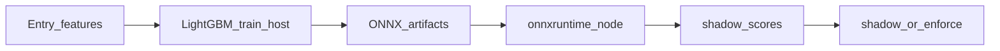

# Deep dive: ReloadSOL ML (what we use + what to learn)

Living guide for understanding the ML in this repo — not a general ML textbook. Pair with [OPERATOR_STATE.md](./OPERATOR_STATE.md), [ML_GATE_PLAN.md](./ML_GATE_PLAN.md), and [ml/README.md](../ml/README.md).

**Snapshot (Jul 2026):** ~79 sim-outcome training rows (0 incomplete, ~39 volume-imputed); gate blocked until **200** labeled; potential trained but macro-F1 ~**0.37** → not ready; pattern-gate shadow, `pattern_ready: false`. All modes default **shadow**.

---

## 1. What ReloadSOL ML is

We train **tabular classifiers** with **LightGBM** on the host, export **ONNX**, and score in Node (`onnxruntime-node`) on sim opens. No neural nets, no RL, no unsupervised clustering in the live path.

| Track | Problem | Labels | Artifact | Default mode |
|-------|---------|--------|----------|--------------|
| **pattern-gate** | Binary classification | winner (≥120% 24h) / loser (&lt;80%) | `ml/artifacts/pattern-gate/` | `ML_PATTERN_MODE=shadow` |
| **v2-gate** | Binary classification | `gate_class` 0=skip, 1=allow (≥20% win) | `ml/artifacts/v2-gate/` | `ML_GATE_MODE=shadow` |
| **v2-potential** | Multiclass (4 tiers) | `potential_tier` 1–4 on gate=1 only | `ml/artifacts/v2-potential/` | `ML_POTENTIAL_EXIT_MODE=shadow` |

**Entry features (12 columns)** feed gate/potential — exported via `ml:export-entry-features` (`--features v1` flag). This is **not** a model; legacy v1 multiclass model removed.

### Readiness bars

| Stage | Min rows | Ready if | Meta flag |
|-------|----------|----------|-----------|
| Gate | **200** labeled | macro-F1 ≥ **0.65**, test ≥ 20 | `gate_ready` |
| Potential | **30** gate=1 | macro-F1 ≥ **0.55**, test ≥ 10 | `gate_ready` (shared name) |
| Pattern | **60** total, ≥30 per class | macro-F1 ≥ **0.60**, test ≥ 10 | `pattern_ready` |

### Shadow vs enforce / apply

- **Shadow:** score and stamp `entry_features` (`ml_gate_*`, `ml_potential_*`, `ml_pattern_*`); does **not** block entries or change live exits.
- **Enforce (gate/pattern):** can reject entries when mode is `enforce`.
- **Apply (potential):** can adjust sim TP/SL via exit overlay; live never.

Checker/maker rule: models see **entry-time features only** — never exit PnL, monitor path, or strategy weights as inputs.

---

## 2. Topic map (your learning lists)

| Your list | For this repo | Why |
|-----------|---------------|-----|
| Linear regression, logistic regression, classification | **Must learn** | Labels are classes; models output class probabilities; you need precision/recall/F1, not “accuracy only”; `log1p` features are standard tabular prep |
| Decision trees, random forest, XGBoost (+ LightGBM) | **Must learn** | Entire stack is **gradient-boosted trees (LightGBM)**. RF = bagging cousin; XGBoost ≈ sibling. Neural nets = **not used** |
| Unsupervised, anomaly detection, recommenders, RL | **Skip for now** | Not in the pipeline. Optional curiosity later |

**Start here:** classification + logistic intuition → decision trees → gradient boosting (LightGBM) → metrics & leakage → ONNX deploy. Skip deep learning and RL until this path is solid.

---

## 3. Learning path (ordered)

### Phase A — Foundations (classification)

1. Supervised learning: features → label → predict.
2. Binary vs multiclass; one-hot / categorical encoding (our `band_*`, `entry_template_*`).
3. Logistic regression intuition: probability of class 1, decision threshold (we use thresholds like `ML_GATE_P_BAD_MAX`, pattern `decision_threshold`).
4. Why accuracy lies on imbalanced data (pattern often predicts “loser”; high accuracy, weak winner recall).

**Map to repo:** `gate_class`, `potential_tier`, `pattern_class`; PnL bands in `ml/features.py` / `outcome-labeling.ts`.

### Phase B — Trees and boosting (the real model)

1. Decision tree: split on feature thresholds.
2. Random forest: many trees, average (bagging) — conceptual cousin only.
3. Gradient boosting: trees added sequentially to fix residuals → **LightGBM** / XGBoost family.
4. LightGBM knobs we use: `learning_rate`, `num_leaves`, early stopping, time-based holdout.

**Map to repo:** `ml/train.py`, `ml/train_pattern.py` → `model.lgb.txt` + `model.onnx` + `model.meta.json`.

### Phase C — Metrics, leakage, readiness

1. Precision, recall, F1, **macro-F1** (why we gate on it).
2. Train vs holdout; **time-based** split (no random shuffle of future into train).
3. Leakage: never train on exit mcap, `pnl_pct`, `monitor_snapshots`, post-entry info.
4. Feature importance (gain) in `model.meta.json` — which inputs the model actually uses.

**Map to repo:** `gate_ready` / `pattern_ready`; OPERATOR_STATE baselines; volume impute (`log_volume_at_entry=0`) shifts distribution.

### Phase D — Deploy path (ONNX)

1. Train in Python → convert LightGBM → ONNX.
2. Node loads ONNX at runtime; feature vector order must match training columns.
3. Shadow stamp → review → only then flip mode.

**Map to repo:** `entry-ml-scorer.server.ts`, `entry-pattern-scorer.server.ts`, `ml-entry-shadow.ts`.

### Phase E — Project labs (hands-on)

1. Read one closed outcome’s `entry_features` and rebuild the 12-dim gate vector by hand.
2. Run `npm run ml:export` and inspect `ml/data/v2/dataset_manifest.json`.
3. Compare `ml_gate_predicted` / `ml_potential_tier` on Admin Reports vs actual PnL tier.
4. Read `model.meta.json` after a train: `macro_f1`, `train_rows`, `feature_importance`.

---

## 4. Features and labels (cheat sheet)

### Sim-outcome gate / potential (12 features)

| Feature | Transform |
|---------|-----------|
| `entry_mcap` | `log1p` → `log_entry_mcap` |
| `organic_score`, `top_holders_pct` | raw |
| `token_age_hours` | raw, cap 168h |
| `volume_at_entry` | `log1p`; missing → **0** (imputed) |
| `entry_template` | binary `milestone_80` |
| `entry_mcap_band` | one-hot `band_*` (6) |

Required for extract: mcap, organic, holders, age. Volume optional.

**PnL → `training_class`:** 0 (&lt;20% / loss), 1 (20–50), 2 (50–100), 3 (100–300), 4 (≥300).  
`gate_class` = 0 iff class 0 else 1. `potential_tier` = class when gate=1.

### Pattern (7 features)

`log_first_mcap`, mention/channel timing, smart-wallet flags, GMGN FOMO source — see `ml/pattern_features.py`.

---

## 5. Repo walkthrough (read in order)

1. [ml/README.md](../ml/README.md) — ops commands  
2. [docs/ML_GATE_PLAN.md](./ML_GATE_PLAN.md) — design + leakage rules  
3. [ml/features.py](../ml/features.py) — labels + vector  
4. [src/strategies/ml-training-features.ts](../src/strategies/ml-training-features.ts) — TS mirror  
5. [ml/train.py](../ml/train.py) — gate / potential train + F1  
6. [ml/train_pattern.py](../ml/train_pattern.py) — pattern train + threshold tune  
7. [src/strategies/ml-entry-shadow.ts](../src/strategies/ml-entry-shadow.ts) — runtime hook  
8. [docs/OPERATOR_STATE.md](./OPERATOR_STATE.md) — live modes + baselines  

---

## 6. References (external)

### Foundations

- [Google Machine Learning Crash Course — Classification](https://developers.google.com/machine-learning/crash-course/classification)  
- [Google ML Crash Course — Logistic regression](https://developers.google.com/machine-learning/crash-course/logistic-regression)  
- [sklearn: Classification metrics](https://scikit-learn.org/stable/modules/model_evaluation.html#classification-metrics) (precision, recall, F1, macro average)

### Trees / boosting / LightGBM

- [LightGBM LGBMClassifier](https://lightgbm.readthedocs.io/en/stable/pythonapi/lightgbm.LGBMClassifier.html)  
- [LightGBM Parameters](https://lightgbm.readthedocs.io/en/latest/Parameters.html) (`objective` binary / multiclass, `num_class`, leaves, learning rate)  
- [Multiclass classification with LightGBM (GeeksforGeeks overview)](https://www.geeksforgeeks.org/machine-learning/multiclass-classification-using-lightgbm/)  
- Optional cousin: skim XGBoost “introduction to boosted trees” once LightGBM clicks — same family, different package

### ONNX deploy

- [onnxmltools LightGBM convert](https://github.com/onnx/onnxmltools/blob/main/onnxmltools/convert/lightgbm/convert.py)  
- [LightGBM → ONNX inference walkthrough](https://io.traffine.com/en/articles/lightgbm-model-conversion-and-iInference-with-onnx)  
- [ONNX Runtime](https://onnxruntime.ai/) — what Node uses at score time  

### Skip until later

- Deep learning / transformers courses  
- RL (policy gradients, Q-learning)  
- Recsys / clustering courses  

---

## 7. Todo checklist

### Study todos

- [ ] Finish Phase A: binary vs multiclass, probability threshold, why accuracy ≠ F1  
- [ ] Finish Phase B: tree → boosting → what `num_leaves` / early stopping mean in our `train.py`  
- [ ] Finish Phase C: read one `model.meta.json`; explain macro-F1 and time holdout in your own words  
- [ ] Finish Phase D: trace one sim open from features → ONNX → `ml_*` fields on `entry_features`  
- [ ] Lab: rebuild a gate feature vector from a real outcome JSON  

### Ops todos (current state)

- [ ] Keep `ML_GATE_MODE` / `ML_PATTERN_MODE` / `ML_POTENTIAL_EXIT_MODE` at **shadow**  
- [ ] Deploy / restart web after potential retrain so `v2-potential` ONNX is loaded  
- [ ] Weekly: `npm run ml:export` → `ml:check-potential` (and gate check when near 200 rows)  
- [ ] Retrain potential when more gate=1 closes land; retrain gate only at **≥200** labeled  
- [ ] Review Admin Gate / Potential / Exit badges vs outcomes before any `apply` / `enforce`  
- [ ] Optional: more `backfill-features?limit=15` to reduce `volume_imputed` before big retrains  
- [ ] Do **not** change frozen entry/exit rules mid-collection (`mcap_enter_at_80` etc.)  

### Done when (milestones)

| Milestone | Meaning |
|-----------|---------|
| You can explain gate vs potential vs pattern without notes | Study path working |
| ≥200 labeled + gate `gate_ready` | First serious gate retrain candidate |
| Potential macro-F1 ≥ 0.55 + good counterfactual review | Consider `ML_POTENTIAL_EXIT_MODE=apply` (sim) |
| Pattern `pattern_ready` + winner recall not ~0 | Consider pattern enforce |

---

## 8. One-sentence summary

**ReloadSOL ML = supervised classification with LightGBM on entry features, scored via ONNX in shadow until F1 and sample-size bars say ready — learn classification + trees/boosting first; skip neural nets / RL / unsupervised for now.**
