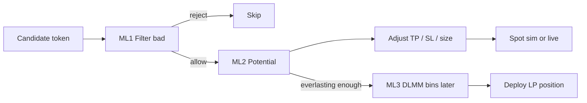
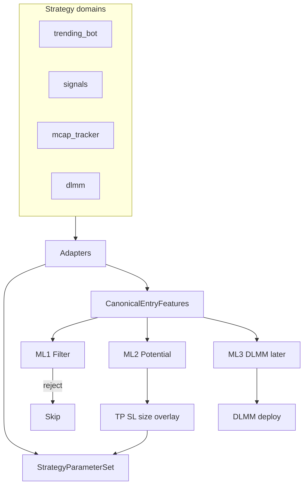

# ReloadSOL Engine — Strategies & ML

Living architecture for how **strategies**, **outcomes**, and **ML heads** fit together.

Related: [STRATEGY_ARCHITECTURE.md](./STRATEGY_ARCHITECTURE.md) · [algo_overview.md](./algo_overview.md) · [ML_GATE_PLAN.md](./ML_GATE_PLAN.md) · [OPERATOR_STATE.md](./OPERATOR_STATE.md) · [ARCHITECTURE_SUMMARY.md](./ARCHITECTURE_SUMMARY.md)

**Data layer:** Docker Postgres `reloadsol_db` only. Schema: [`db/init/`](../db/init/).

---

## 1. North-star: three ML heads, one streamline

Every token candidate should hit the **same three ML jobs** in order — regardless of which strategy domain discovered it.

| Head | Job | Trading effect |
|------|-----|----------------|
| **ML1 — Filter** | Hinder bad tokens (rug / dump / low quality) | Skip entry → better profitability |
| **ML2 — Potential** | Expected upside band (e.g. 2–5x / 10x) | Adjust **TP, SL**, optional size |
| **ML3 — DLMM geometry** | Bin range + positioning | Deploy / rebalance LP (**later**) |

**Principle:** strategies are **capture / execution surfaces**. ML is a **shared spine** (canonical features → three heads), not a separate model per strategy ID.

Do **not** collapse the three heads into one multiclass model — labels and actions differ.

---

## 2. Strategy domains (what we have)

| Domain | Strategy IDs | UI | Execution |
|--------|--------------|-----|-----------|
| `trending_bot` | `att`, `lowcap_moonbag`, `scalper`, `hodl` | `/dev/strategies`, algo tester | `POST /api/trending/track` |
| `signals` | `signals_default`, `signals_sell_over_100` | `/dev/signals` | Scoring API + `POST /api/signals/sim-track` |
| `mcap_tracker` | `mcap_enter_first_seen`, `mcap_enter_at_80` | Tracker / strategies | `POST /api/mcap-tracking/sim-track` |
| `dlmm` | `dlmm_default` | `/dev/dlmm` | screen / sim-track / manage |

Config source: code registry [`src/strategies/registry.ts`](../src/strategies/registry.ts) + Postgres `strategy_definitions` JSONB overrides (DLMM also uses `dlmm_agent_config` + env).

Full per-strategy capture/calculate/result: [algo_overview.md](./algo_overview.md).

### Config shape differences (today)

| Domain | Shape | Entry | Exit |
|--------|-------|-------|------|
| `trending_bot` | Flat (`buy_amount_sol`, `take_profit_levels`, …) | `TokenFilterConfig` bands | Multi-TP + SL + max hold |
| `signals` | Nested `query` / `scoring` / `execution` | Score floor + growth | Sim close / `sell_over_100` |
| `mcap_tracker` | Nested `entry` / `exit` / `execution` | `first_seen` / `milestone_80` | Single TP / SL / hold |
| `dlmm` | Nested LP thresholds | Pool TVL / fee / holders | TP / SL / OOR |

Outcomes unify in `strategy_outcomes` (`domain`, `strategy_id`, `features` JSONB) via [`src/strategies/outcomes.ts`](../src/strategies/outcomes.ts) → `insertStrategyOutcome`.

---

## 3. Operator alerts (two-stage copy trade)

Separate from ML enforce — notifications for **manual** copy trading.

| Stage | Trigger | Surfaces |
|-------|---------|----------|
| **Stage 1 — Early Enter** | Signals `decision=enter` and growth &lt; 100% | Telegram + toast (`signals_enter`); Pattern ML **shadow** `pW` on message / Signals **ML** column |
| **Stage 2 — Mcap Sim Open** | `mcap_enter_first_seen` / `mcap_enter_at_80` paper open | Telegram + toast (`sim_open`) |

- Drain: `GET /api/mcap-tracking/sim-open-alerts` (app-wide toast host).
- Stage 1 does **not** open a sim position; ML shadow never blocks Stage 1 until explicitly wired + `pattern_ready`.
- Dedup: 24h per mint (Stage 1) / per strategy+mint (Stage 2).

Mcap milestones (tracking truth): `when_reach_80/120/200pct`, `when_drop_40/80pct`, `peak_*` — see [`db/init/07-mcap-drop-peak.sql`](../db/init/07-mcap-drop-peak.sql). Auto-labels: `potential` / `rugged`.

---

## 4. What ML does today vs the streamline

| Head | Check (today) | Adjust (today) | Gap |
|------|---------------|----------------|-----|
| **ML1 Filter** | Shared [`attachMlEntryShadow`](../src/strategies/ml-entry-shadow.ts) on **mcap / signals / trending** opens (`ml_gate_*` + Pattern `ml_pattern_*`); Stage-1 displays Pattern shadow | Enforce can **skip** mcap sim open when `gate_ready` + `ML_GATE_MODE=enforce` | Enforce not on signals/trending; Pattern `pattern_ready: false`; Stage-1 never blocks; DLMM skips ONNX until mint+core features (`ml_skipped`) |
| **ML2 Potential** | Same helper stamps `ml_potential_*` on opens; [`applyPotentialToExitParams`](../src/strategies/potential-exit-overlay.ts) + `ML_POTENTIAL_EXIT_MODE` | **shadow** (default): audit `ml_exit_*` + counterfactual log; **apply**: sim mcap/trending freeze `effective_exit` / sim TP-SL | Live TP/SL still registry; signals scoring exits not rewritten |
| **ML3 DLMM bins** | Rules + [`reasoner.ts`](../src/utils/dlmm/reasoner.ts); fixed `bin_range_interval`; outcomes mint-keyed when resolvable (`token_address=mint`, `features.pool_address`) | Manual / rule bin width | No trained bin model yet |

**Artifacts**

| Artifact | Role | Env |
|----------|------|-----|
| `ml/artifacts/v2-gate/` | ML1 binary gate | `ML_GATE_MODE`, `ML_GATE_P_BAD_MAX` |
| `ml/artifacts/v2-potential/` | ML2 tiers (advisory) | `ML_POTENTIAL_ARTIFACT_DIR` |
| `ml/artifacts/pattern-gate/` | Pattern winner/loser (primary cohort ML) | `ML_PATTERN_MODE`, `ML_PATTERN_P_WINNER_MIN` |

Labels:

- **Pattern ML:** 24h cohort (`mcap_social_pattern_24h`) — winner ≥120% growth, loser &lt;80%.
- **Sim-outcome gate / potential:** closed `strategy_outcomes` PnL tiers (`training_class` 0–4).

---

## 5. Target: shared spine for all strategies

Normalization so ML1 → ML2 → ML3 is one pipe.

### 5.1 `StrategyParameterSet` (all domains)

Target module: `src/strategies/canonical-params.ts`

Shared fields: `domain`, `strategyId`, `executionMode`, `positionSizeSol`, `entry` (trigger + bands), `exit` (stopLossPct, takeProfitPct, takeProfitLadder?, maxHoldHours, oorTimeoutMin?), `social?`, `extensions`.

Adapters map each domain’s registry config → this shape (read-only on admin API first).

**ML2 write-back:** overlay `exit.*` (and optional size) from potential tier / `p_winner` — sim-only first.

### 5.2 `CanonicalEntryFeatures` (token-centric)

Target module: `src/strategies/canonical-features.ts` — `feature_schema_version: 1`

| Field | Meaning |
|-------|---------|
| `mint_address` | Token mint (always when known) |
| `pool_address` | DLMM pool (optional elsewhere) |
| `instrument` | `spot_token` \| `dlmm_lp` |
| Core | `entry_mcap`, band, organic, holders, age, **token** volume, unified social names |
| `domain_features.*` | Domain leftovers (milestones, score, fee/TVL, …) |

**Monitor snapshots / volume:** `resolveTokenMonitorSnapshot` fills `price_usd` + `volume_5m` via tracker → `token_mcap_tracking.volume_5m` → Jupiter v2 (`usdPrice`, `stats5m` buy+sell, `mcap`). Entry `volume_at_entry` / `entry_mcap` use the same waterfall so V1 gate rows are not skipped for incomplete features. Signals/trending closes call `ensureCompleteBuyFeaturesForOutcome`. `monitor_snapshots` are path/series data (not V1 gate inputs); do not backfill historical null ticks. Ops: `POST /api/strategies/ml/backfill-features` for historical null core fields; dataset-stats exposes `incomplete_by_field`.

**DLMM fix:** today `recordDlmmOutcome` sets `token_address = poolAddress`. Target: `token_address = mint`, `features.pool_address = pool`, `instrument = dlmm_lp`, plus `buildFullEntryFeatureSnapshot(mint)` when possible. Pool volume stays under `domain_features.dlmm`, not token `volume_at_entry`.

Legacy pool-only rows: exclude from ML1/ML2 spot training unless mint is present.

### 5.3 Heads on the spine

| Head | Reuse | Action |
|------|-------|--------|
| **ML1** | Gate `v2-gate`; Pattern loser / low `pW`; rug drops / `label=rugged` | Skip entry |
| **ML2** | Potential tiers + Pattern `p_winner` | `applyPotentialToExitParams` → TP/SL/size |
| **ML3** | Later: token features + DLMM bag | `bin_range_interval`, position sizing |

---

## 6. Entry feature builder (already shared)

Memecoin opens should use:

1. [`buildFullEntryFeatureSnapshot`](../src/strategies/resolve-entry-snapshot.ts)
2. [`annotateEntryFeatures`](../src/strategies/social/context.ts) when social exists
3. `toCanonicalEntryFeatures` before `insertStrategyOutcome` (schema v1 + aliases)
4. `attachMlEntryShadow` after annotate (shadow on all memecoin opens; mcap may enforce)

Richest path: **mcap_tracker** sim open (shared helper + optional enforce). Signals / trending attach the same shadow fields without skipping.

---

## 7. Roadmap

| Phase | Scope |
|-------|--------|
| **A — Normalize** | Canonical params + features; DLMM mint/pool; ML extractors via aliases; docs (this file) |
| **B — ML2 adjust** | Potential → TP/SL overlay on sim strategies (`ML_POTENTIAL_EXIT_MODE`; default shadow) — **done** |
| **B.2 / Phase 3 — ML2 ops** | Editable overlay table + admin apply override + `ML_POTENTIAL_MIN_ROWS` — **done** |
| **C — ML1 broaden** | Enforce filter on more domains when `gate_ready` / `pattern_ready` |
| **D — ML3** | Train bin/position model on mint-keyed DLMM outcomes |

### Explicit non-goals (until ready)

- Live TP/SL auto-adjust without shadow review
- One multiclass model for all three heads
- Mixing Pattern cohort labels with sim-outcome `training_class` into a single head

---

## 8. Operator checklist

| Item | Where |
|------|--------|
| Pattern shadow / readiness | [OPERATOR_STATE.md](./OPERATOR_STATE.md), `/dev/social` Patterns |
| Gate / potential train | `npm run ml:export` → `ml:train-gate` / `ml:train-potential` |
| Pattern train | `npm run ml:pattern-daily` / `ml:train-pattern` |
| Enforce | Only when `*_ready` in `model.meta.json`; default **shadow** |
| Copy-trade Telegram | `TELEGRAM_BOT_TOKEN` + `TELEGRAM_ALERT_CHAT_ID` |
| Drop/peak columns | Apply `db/init/07-mcap-drop-peak.sql` |

---

## 9. Key code map

| Area | Path |
|------|------|
| Registry / types | `src/strategies/registry.ts`, `types.ts` |
| Canonical params / features | `src/strategies/canonical-params.ts`, `canonical-features.ts` |
| Shared open-path ML shadow | `src/strategies/ml-entry-shadow.ts` |
| ML2 exit overlay | `src/strategies/potential-exit-overlay.ts`, `potential-exit-overlay-config.ts` |
| ML2 admin API | `GET/PATCH /api/strategies/ml/exit-overlay` |
| Outcomes | `src/strategies/outcomes.ts`, `db.ts` |
| Entry snapshot | `src/strategies/entry-feature-snapshot.ts`, `resolve-entry-snapshot.ts` |
| Gate / potential scorer | `src/strategies/entry-ml-scorer.server.ts` |
| Pattern scorer | `src/strategies/entry-pattern-scorer.server.ts` |
| Stage-1 early alerts + ML shadow | `src/strategies/signals-early-alerts.ts`, `signals-early-pattern-cache.ts` |
| Sim-open alerts | `src/strategies/mcap-sim-open-alerts.ts` |
| Mcap milestones | `src/utils/mcap-tracker.ts` |
| DLMM reasoner | `src/utils/dlmm/reasoner.ts` |
| Train / features (Python) | `ml/train.py`, `ml/train_pattern.py`, `ml/features.py` |
