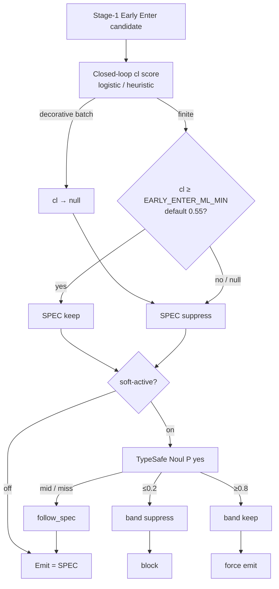
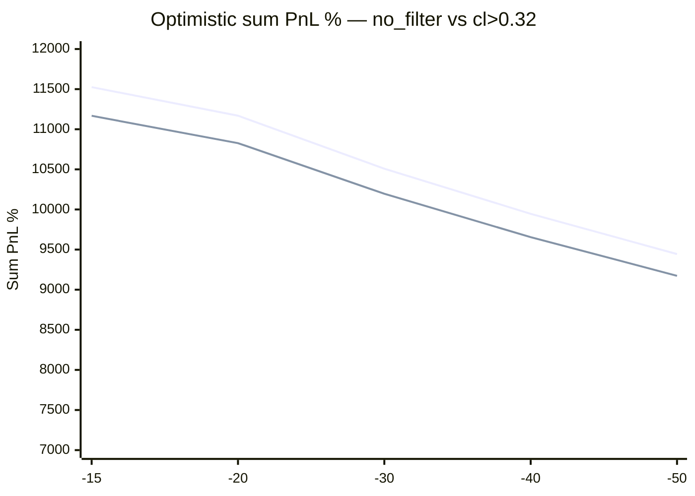
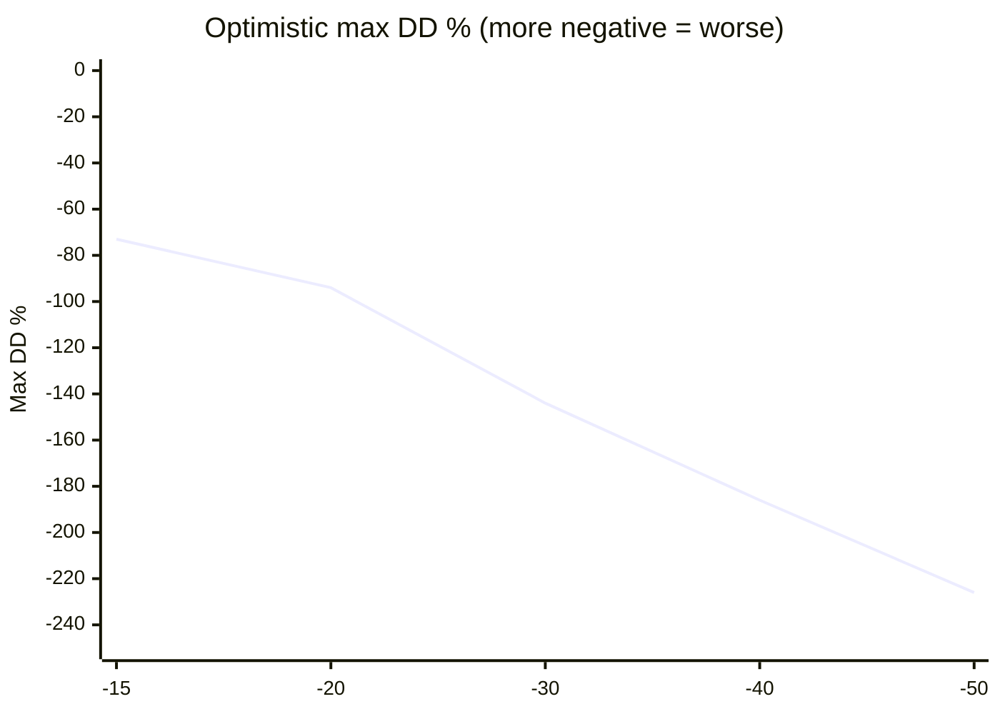

# Early Enter shadow paper book — SL sweep (Sep 23–24 WIB)

**Status:** research / operator report (no product code)  
**Repo SHA at analysis:** `8a2f216` (VPS)  
**Lane:** autotrade & algo  
**Date:** 2026-09-24

## 1. Scope

Unique mints from `early_enter_noul_shadow` with first `predicted_at` in:

- Yesterday: `2026-09-23 00:00+07` → `2026-09-24 00:00+07`
- Today: `2026-09-24 00:00+07` → `2026-09-25 00:00+07`

Joined to `token_mcap_tracking` for `label`, `peak_growth_percent`, `mcap_growth_percent`.

| Filter | Trades |
|--------|--------|
| no_filter | 222 |
| cl_ml_score > 0.32 | 216 |
| live cl ≥ 0.55 | **0** |

Soft-active was **off** (`softActive: false`); live toast follows SPEC only. Noul shadow had **0 `keep` bands** in this window (not applied as an emit override).

## 2. Exit rules used

From `DEFAULT_MCAP_TRACKER_EXIT` in `src/strategies/registry.ts`:

- **TP** fixed at **+200%** from entry
- **SL** swept: **−15 / −20 / −30 / −40 / −50%**
- Notional: `simBuySol: 0.01` per trade

Growth from entry:

- `first_seen` arm: tracker % as-is
- `at_80` arm: rebase `((1 + g/100) / 1.8 − 1) × 100`

**Path proxy (no bar path):**

- **Optimistic:** peak ≥ 200 → TP; else rug or current ≤ SL → SL; else MTM `min(peak, current)`
- **Pessimistic:** every `label=rugged` → SL even if peak ≥ 200

**Drawdown:**

- **Sum loss** = sum of trades with PnL &lt; 0
- **Max DD** = worst peak-to-trough on cumulative sum-PnL% ordered by `predicted_at` (sequential book)

## 3. Decision stack (context)

**cl** = internal closed-loop ML evaluator (`ML_CLOSED_LOOP`, artifact `data/ml-closed-loop/model.json`).  
**Noul / Jev** = external TypeSafe System One primitive (P(yes)), not the same model as cl.  
**Pattern pWinner** = separate ONNX LightGBM track; Early Enter soft gate treats it as **display-only**.

## 4. Optimistic table (peak can unlock TP before rug)

| Filter | SL | Trades | TP | SL hits | Avg PnL% | Sum PnL% | Sum PnL SOL | Sum loss% | Sum loss SOL | Max DD% | Max DD SOL |
|--------|---:|-------:|---:|--------:|---------:|---------:|------------:|----------:|-------------:|--------:|-----------:|
| no_filter | −15 | 222 | 49 | 72 | +51.9 | +11525 | +1.15 | −1230 | −0.123 | −73 | −0.007 |
| no_filter | −20 | 222 | 49 | 70 | +50.3 | +11169 | +1.12 | −1586 | −0.159 | −94 | −0.009 |
| no_filter | −30 | 222 | 49 | 62 | +47.3 | +10508 | +1.05 | −2246 | −0.225 | −144 | −0.014 |
| no_filter | −40 | 222 | 49 | 53 | +44.8 | +9946 | +0.99 | −2808 | −0.281 | −186 | −0.019 |
| no_filter | −50 | 222 | 49 | 49 | +42.5 | +9444 | +0.94 | −3310 | −0.331 | −226 | −0.023 |
| cl > 0.32 | −15 | 216 | 47 | 69 | +51.7 | +11168 | +1.12 | −1185 | −0.118 | −73 | −0.007 |
| cl > 0.32 | −20 | 216 | 47 | 67 | +50.1 | +10827 | +1.08 | −1526 | −0.153 | −94 | −0.009 |
| cl > 0.32 | −30 | 216 | 47 | 59 | +47.2 | +10196 | +1.02 | −2156 | −0.216 | −144 | −0.014 |
| cl > 0.32 | −40 | 216 | 47 | 51 | +44.7 | +9655 | +0.97 | −2697 | −0.270 | −186 | −0.019 |
| cl > 0.32 | −50 | 216 | 47 | 47 | +42.5 | +9173 | +0.92 | −3180 | −0.318 | −226 | −0.023 |

## 5. Pessimistic table (rugs always SL)

| Filter | SL | Trades | TP | SL hits | Avg PnL% | Sum PnL% | Sum PnL SOL | Sum loss% | Sum loss SOL | Max DD% | Max DD SOL |
|--------|---:|-------:|---:|--------:|---------:|---------:|------------:|----------:|-------------:|--------:|-----------:|
| no_filter | −15 | 222 | 41 | 80 | +44.2 | +9805 | +0.98 | −1350 | −0.135 | −75 | −0.008 |
| no_filter | −20 | 222 | 41 | 78 | +42.4 | +9409 | +0.94 | −1746 | −0.175 | −100 | −0.010 |
| no_filter | −30 | 222 | 41 | 70 | +39.0 | +8668 | +0.87 | −2486 | −0.249 | −162 | −0.016 |
| no_filter | −40 | 222 | 41 | 61 | +36.2 | +8026 | +0.80 | −3128 | −0.313 | −220 | −0.022 |
| no_filter | −50 | 222 | 41 | 57 | +33.5 | +7444 | +0.74 | −3710 | −0.371 | −260 | −0.026 |
| cl > 0.32 | −15 | 216 | 39 | 77 | +43.7 | +9448 | +0.94 | −1305 | −0.130 | −75 | −0.008 |
| cl > 0.32 | −20 | 216 | 39 | 75 | +42.0 | +9067 | +0.91 | −1686 | −0.169 | −100 | −0.010 |
| cl > 0.32 | −30 | 216 | 39 | 67 | +38.7 | +8356 | +0.84 | −2396 | −0.240 | −162 | −0.016 |
| cl > 0.32 | −40 | 216 | 39 | 59 | +35.8 | +7735 | +0.77 | −3017 | −0.302 | −220 | −0.022 |
| cl > 0.32 | −50 | 216 | 39 | 55 | +33.2 | +7173 | +0.72 | −3580 | −0.358 | −260 | −0.026 |

## 6. Sum PnL vs SL (diagram)

## 7. Takeaways (facts from this sample)

1. Tighter SL raises **sum PnL** and shrinks **max DD** under this proxy (losers clipped sooner; TP count stays flat).
2. **cl > 0.32 ≈ no_filter** on every row (scores sit near ~0.32).
3. Live **cl ≥ 0.55** enters **0** trades → 0 PnL.
4. Noul is not in the PnL tables; soft-active off and 0 keep bands.

## 8. Caveats

- No per-mint OHLC path → TP vs SL order assumed (opt vs pes).
- Brain `/risk/from-score` exit overrides not applied.
- Equal 0.01 SOL size; sequential DD ≠ live concurrent portfolio.
- Tracker peaks can update after the shadow row; sample is point-in-time at query.

## 9. Related code

- Soft gate: `src/strategies/signals-early-ml-gate.ts`
- Noul bands: `src/strategies/early-enter-noul-shadow.ts` (`DEFAULT_NOUL_NO=0.2`, `DEFAULT_NOUL_YES=0.8`)
- Closed-loop features: `src/strategies/closed-loop-ml.ts` (`CLOSED_LOOP_FEATURE_COLUMNS`)
- Pattern features (not Early Enter gate): `src/strategies/social/pattern-features.ts`
- Exit defaults: `src/strategies/registry.ts` (`DEFAULT_MCAP_TRACKER_EXIT`)
