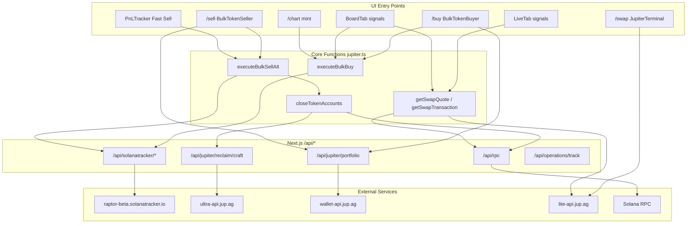
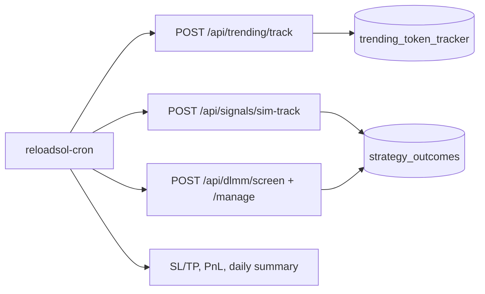

# Trading Process Reference

Comprehensive reference for **single** and **bulk** buy, sell, and close operations: UI entry points, core functions, internal `/api/*` routes, external services, and step-by-step process flows.

**Architecture & automation:** [architecture.md](./architecture.md) (system topology, workers, Postgres `reloadsol_db`) · [algo_overview.md](./algo_overview.md) (strategy domains, Pattern ML, cron) · [API_ARCHITECTURE_SUMMARY.md](./API_ARCHITECTURE_SUMMARY.md) (API route catalog)

---

## Overview

ReloadSOL uses **three execution stacks** for swaps and closes, plus supporting services for wallet data, RPC, and charts.

| Stack | Core functions | Used for |
|-------|----------------|----------|
| **Solana Tracker Raptor** | `executeBulkBuy`, `executeBulkSellAlt`, `executeClientSwap` | Bulk buy/sell; signals (LiveTab, BoardTab); PnL Fast Sell; server bots |
| **Jupiter Lite API** | `getSwapQuote`, `getSwapTransaction` | Single buy/sell (LiveTab, BoardTab instant sell, SL/TP) |
| **Jupiter Reclaim + manual SPL close** | `closeTokenAccounts`, `craftReclaimTransaction` | Bulk close; auto-close after 100% sell |

| Supporting layer | Role |
|------------------|------|
| **Jupiter Portfolio** | Wallet token list + USD values (`useWalletTokens`); PnL Fast Sell / Refresh list holdings prune |
| **`/api/rpc` proxy** | On-chain read/write (balances, send, confirm, manual close) |
| **GMGN iframe** | Price charts on `/buy`, `/sell`, ChartBuyModal (no swap execution) |
| **Toast → buy bridge** | `add-token-to-buy` — toast token click appends mint on `/buy` + opens chart (not `/chart`) |



---

## Fees

From `FEE_CONFIG` in `src/utils/jupiter.ts`:

| Operation | Fee | Recipient |
|-----------|-----|-----------|
| Buy | 0.5% of SOL budget | Dev wallet |
| Sell | 0.5% of SOL received | Dev wallet |
| Close | 0.001 SOL × account closed | Dev wallet |

Dev wallet: `3V3N5xh6vUUVU3CnbjMAXoyXendfXzXYKzTVEsFrLkgX`

Raptor swaps also pass `feeAccount` / `feeBps` (50 bps) to Solana Tracker on bulk paths.

---

## Bulk Operations

Primary UI: `/buy` and `/sell`. Source: `BulkTokenBuyer.tsx`, `BulkTokenSeller.tsx`, `src/utils/jupiter.ts`.

Wallet tokens: `useWalletTokens` → `GET /api/jupiter/portfolio` → `https://wallet-api.jup.ag/v2/portfolio/holdings/:wallet`.

### Bulk Buy

| Item | Detail |
|------|--------|
| **Route** | `/buy` |
| **UI handler** | `BulkTokenBuyer.handleBulkBuy` |
| **Core function** | `executeBulkBuy` |

**Process steps**

1. User selects up to 10 token mints and SOL budget.
2. `executeBulkBuy` splits budget per token; batches quote-and-swap (10 per batch).
3. For each token: `fetchRaptorQuoteAndSwap` → `POST /api/solanatracker/swap` → Raptor `POST /quote-and-swap`.
4. Wallet signs all swap transactions: `signAllTransactions`.
5. Send (batches of 6): `sendRaptorTransaction` → `POST /api/solanatracker/send` → Raptor `POST /send-transaction`.
6. Confirm: `waitForRaptorConfirmation` (poll until `confirmed`; throws on pending timeout); RPC `confirmTransaction` on RPC fallback only.
7. Track: `trackBuy` → `POST /api/operations/track`; `trackOperation` → `POST /api/trading/records`.
8. Refresh token list via `useWalletTokens` / Jupiter Portfolio.

**Internal APIs**

| Route | Method | Purpose |
|-------|--------|---------|
| `/api/solanatracker/swap` | POST | Build swap tx (SOL → token) |
| `/api/solanatracker/send` | POST | Broadcast signed tx via Raptor |
| `/api/solanatracker/transaction/[signature]` | GET | Poll swap status |
| `/api/jupiter/portfolio` | GET | Wallet token list |
| `/api/rpc` | POST | RPC fallback send/confirm |
| `/api/operations/track` | POST | Points |
| `/api/trading/records` | POST | History / PnL |
| `/api/solprice` | GET | SOL/USD for UI |
| `/api/tokens/prices` | GET | Token prices (supporting) |
| `/api/trending/search` | GET | Token search in buyer UI |
| `/api/axiom/token-info` | GET | Risk analysis panel |

**External**

| Service | URL |
|---------|-----|
| Raptor | `https://raptor-beta.solanatracker.io` (`RAPTOR_API_BASE` env override) |
| Jupiter Portfolio | `https://wallet-api.jup.ag/v2/portfolio/holdings` |
| GMGN chart | `https://www.gmgn.cc/kline/sol/{mint}` (iframe only) |

---

### Bulk Sell

| Item | Detail |
|------|--------|
| **Route** | `/sell` |
| **UI handler** | `BulkTokenSeller.handleBulkSell` |
| **Core function** | `executeBulkSellAlt` |

**Process steps**

1. User selects sellable tokens (percent or amount per token).
2. Quote preview (UI only): `fetchQuoteForToken` → `GET /api/solanatracker/quote`.
3. `executeBulkSellAlt` builds Raptor swaps (token → SOL) per selected token — same sign/send/poll chain as bulk buy.
4. After successful 100% sells: `closeTokenAccounts` runs automatically for those mints (see Bulk Close below).
5. Track: `trackSell`, optional `trackClose` → `/api/operations/track`; `trackOperation` → `/api/trading/records`.

**Internal APIs**

Same Raptor + RPC routes as bulk buy, plus:

| Route | Method | Purpose |
|-------|--------|---------|
| `/api/solanatracker/quote` | GET | Pre-trade quote display (not execution) |
| `/api/jupiter/reclaim/craft` | POST | Auto-close after 100% sell |

**External**

Same as bulk buy (Raptor, Portfolio, GMGN charts).

---

### Bulk Close (close-only)

| Item | Detail |
|------|--------|
| **Route** | `/sell` (Close button, no swap) |
| **UI handler** | `BulkTokenSeller.handleCloseOnly` |
| **Core function** | `executeBulkSellAlt({ tokens: [], unsellableTokens })` → `closeTokenAccounts` |

**Process steps**

1. User selects dust / zero-balance / unsellable tokens to close.
2. `filterClosableTokens` — excludes frozen tokens only (no false “already closed” from SPL ATA lookup).
3. **Primary — Jupiter Reclaim**
   - `craftReclaimTransaction` → `POST /api/jupiter/reclaim/craft` → `POST https://ultra-api.jup.ag/reclaim/craft` with `{ owner, mints }`.
   - `injectInstructionsIntoVersionedTransaction` — append close fee (`0.001 SOL × account`) via `createFeeTransferInstructions('CLOSE')`.
   - One wallet sign → send via `/api/rpc` → confirm.
4. **Fallback — manual SPL close** (if craft fails)
   - `resolveTokenAccountsForManualClose` — `getParsedTokenAccountsByOwner({ mint })`, SPL + Token-2022 ATA fallback.
   - Burn if balance > 0, then `createCloseAccountInstruction` (Solana [close-account](https://solana.com/docs/tokens/basics/close-account) flow).
   - Append close fee instructions → sign → RPC send.
5. **Success rule**: UI shows success only when `signatures.length > 0` (no wallet sign = no success modal).
6. Track: `trackClose` + `trackOperation` (gated on confirmed signature).

**Internal APIs**

| Route | Method | Purpose |
|-------|--------|---------|
| `/api/jupiter/reclaim/craft` | POST | Craft reclaim transaction |
| `/api/rpc` | POST | Send/confirm close tx; manual path account lookup |

**External**

| Service | URL |
|---------|-----|
| Jupiter Ultra Reclaim | `https://ultra-api.jup.ag/reclaim/craft` (`JUPITER_ULTRA_API_BASE` override) |

**Note:** `closeZeroBalanceTokens` in `jupiter.ts` uses the same reclaim/manual chain but is **not wired** in the BulkTokenSeller UI today.

---

## Single Operations

The codebase has **multiple entry points** with different execution stacks. Close behavior varies by path.

### Summary matrix

| Operation | UI entry | Execution stack | On-chain ATA close? |
|-----------|----------|-----------------|---------------------|
| Single buy | LiveTab (`/dev/signals?tab=live`) | Jupiter Lite | No |
| Single buy | BoardTab instant buy | Raptor (`executeBulkBuy`, 1 mint) | No |
| Single buy | `/chart/[mint]`, ChartBuyModal | Raptor (`executeBulkBuy`, 1 mint) | No |
| Single buy | `/swap` JupiterTerminal | Jupiter widget | No |
| Single sell | LiveTab | Jupiter Lite | **No** |
| Single sell | BoardTab instant sell | Jupiter Lite | **No** |
| Single sell | PnL Fast Sell (`/pnl`) | Raptor (`executeBulkSellAlt`, 1 token, 100%) | **Yes** (auto reclaim) |
| Single sell | `/swap` JupiterTerminal | Jupiter widget | No |
| Single close | PnL Fast Sell (post 100% sell) | Jupiter Reclaim + manual fallback | Yes |
| Single close | LiveTab / BoardTab sim | DB only (`trackSimClose`) | N/A (simulation) |
| Single close | Dedicated close UI | **Bulk only** (`handleCloseOnly`) | Yes |

---

### Single Buy

#### A. LiveTab — Jupiter Lite

**File:** `src/components/signals/LiveTab.tsx`

```
handleTokenHover → fetchSingleBuyQuote → getSwapQuote(SOL → token)
handleBuyToken
  → createFeeTransferInstructions('BUY')
  → getSwapTransaction(quote, feeInstructions)
  → signTransaction → connection.sendRawTransaction → confirmTransaction
  → trackRealBuy → POST /api/trading/records
  → trackBuy → POST /api/operations/track
```

| Internal API | External |
|--------------|----------|
| `/api/trading/records`, `/api/operations/track`, `/api/tokens/prices`, `/api/signals`, `/api/axiom/token-info`, `/api/rpc` | `lite-api.jup.ag/swap/v1/quote`, `lite-api.jup.ag/swap/v1/swap` |

#### B. BoardTab / Chart / ChartBuyModal — Raptor

**Files:** `BoardTab.tsx`, `chart/[tokenAddress]/page.tsx`, `ChartBuyModal.tsx`

```
handleInstantBuy (or chart buy)
  → executeBulkBuy({ tokenMints: [one mint], solAmount, ... })
  → [same Raptor chain as Bulk Buy]
  → trackBuy + trackOperation
```

| Internal API | External |
|--------------|----------|
| `/api/solanatracker/swap`, `/send`, `/transaction/:sig`, `/api/jupiter/portfolio`, `/api/rpc` | `raptor-beta.solanatracker.io` |

#### C. `/swap` — Jupiter Terminal

**Files:** `SwapPageClient.tsx`, `JupiterTerminal.tsx`

```
Jupiter.init({ onSuccess: handleSwapSuccess, endpoint: RPC via /api/rpc })
  → Jupiter widget handles quote / swap / sign / send internally
handleSwapSuccess → trackOperation (jupiter_swap: true)
```

| Internal API | External |
|--------------|----------|
| `/api/trading/records`, `/api/rpc` | `terminal.jup.ag/main-v4.js`, Jupiter swap APIs inside widget |

#### D. `/api/buy` — server route (orphan)

**File:** `src/app/api/buy/route.ts`

```
POST { tokenAddress, solLamports, userPublicKey }
  → getSwapQuote → getSwapTransaction → inject tip → return unsignedTxBase64
POST { signedTxBase64 } → sendRawTransaction → confirm
```

**No frontend caller** in `src/` today. Listed in `api-access.ts` only.

---

### Single Sell

#### A. LiveTab — Jupiter Lite

**File:** `LiveTab.tsx`

```
fetchSellQuotes / handleSidebarHover → getSwapQuote(token → SOL)
handleSellToken / handleSidebarSell
  → createFeeTransferInstructions('SELL')
  → getSwapTransaction → signAllTransactions → sendRawTransaction → confirm
  → trackRealSell → trackOperation
```

**No ATA close** after sell.

| Internal API | External |
|--------------|----------|
| `/api/trading/records`, `/api/rpc`, `/api/tokens/prices` | Jupiter Lite quote/swap |

#### B. BoardTab — Jupiter Lite instant sell

**File:** `BoardTab.tsx`

```
handleInstantSell
  → getParsedTokenAccountsByOwner({ mint })
  → getSwapQuote → getSwapTransaction
  → signAllTransactions → sendRawTransaction → confirm
  → trackOperation
```

**No fee instructions, no ATA close.**

#### C. PnL Fast Sell — Portfolio resolve + Raptor (real) / mark-close (SIM)

**File:** `PnLTracker.tsx` · helper `resolveWalletTokenToSell` in `jupiter-portfolio.ts`

```
handleFastSell
  → if isSimulation:
      closeSimulationPosition (DB / local mark-close; no on-chain swap)
  → else:
      resolveWalletTokenToSell (Jupiter Portfolio → cached walletTokenData → RPC)
      require uiAmount / balance > 0 (else disable: “Not in wallet…”)
      executeBulkSellAlt({ sellAmount: balance, slippage: 200, priorityFee: 30000 })
        → Raptor swap (token → SOL)
        → closeTokenAccounts (100% sell)
          → Jupiter Reclaim primary → manual SPL fallback
      → trackSell + trackOperation
```

**Open list:** **Refresh list** re-runs `calculatePnL` with `pruneOpenPositionsByHoldings` — real opens must appear in Jupiter Portfolio (dust filtered); sims kept. All / Real / Sim pills filter open + completed.

**Only single-token real path that reclaims rent** after sell.

| Internal API | External |
|--------------|----------|
| `/api/jupiter/portfolio` + Raptor + `/api/jupiter/reclaim/craft` + `/api/rpc` | Jupiter Portfolio + Raptor + Jupiter Ultra reclaim |

#### D. `/swap` — Jupiter Terminal

Same widget as buy; Token → SOL classified as sell in `handleSwapSuccess`. **No ATA close.**

#### E. SL/TP monitor — automated (server)

**Files:** `sl-tp-tracker.ts`, `/api/sl-tp-monitor/route.ts`

```
runSLTPMonitor → getSwapQuote → getSwapTransaction
  → tradingKeypair.sign → sendRawTransaction
  → Postgres `sl_tp_positions` update
```

Server-side Jupiter Lite with configured keypair; not triggered from UI buttons.

---

### Single Close

| Type | Where | Mechanism |
|------|-------|-----------|
| **On-chain reclaim** | PnL Fast Sell after 100% Raptor sell | `closeTokenAccounts` → Jupiter Reclaim → manual fallback |
| **On-chain close-only** | `/sell` handleCloseOnly | Same as Bulk Close (can close one or many mints) |
| **Simulation close** | LiveTab, BoardTab, PnL sim positions | `trackSimClose` / `closeSimulationPosition` — DB only |
| **Jupiter Lite sells** | LiveTab, BoardTab | **Do not close** token accounts |

---

## Core Functions Reference

| Function | File | Buy | Sell | Close |
|----------|------|:---:|:----:|:-----:|
| `executeBulkBuy` | `src/utils/jupiter.ts` | Bulk, single (Raptor) | — | — |
| `executeBulkSellAlt` | `src/utils/jupiter.ts` | — | Bulk, PnL Fast Sell | Triggers close |
| `closeTokenAccounts` | `src/utils/jupiter.ts` | — | — | Bulk + post-sell |
| `closeZeroBalanceTokens` | `src/utils/jupiter.ts` | — | — | Exported; not in UI |
| `filterClosableTokens` | `src/utils/jupiter.ts` | — | — | Pre-close filter (frozen only) |
| `executeCloseForTokens` | `src/utils/jupiter.ts` | — | — | Reclaim → manual |
| `tryJupiterReclaimClose` | `src/utils/jupiter.ts` | — | — | Primary close |
| `executeManualCloseTransaction` | `src/utils/jupiter.ts` | — | — | SPL burn + CloseAccount |
| `getSwapQuote` | `src/utils/jupiter.ts` | Single (Lite) | Single (Lite) | — |
| `getSwapTransaction` | `src/utils/jupiter.ts` | Single (Lite) | Single (Lite) | — |
| `createFeeTransferInstructions` | `src/utils/jupiter.ts` | All paid ops | All paid ops | Close fee |
| `craftReclaimTransaction` | `src/utils/jupiter-reclaim.ts` | — | — | Primary close |
| `injectInstructionsIntoVersionedTransaction` | `src/utils/jupiter-reclaim.ts` | — | — | Append fees to reclaim tx |
| `fetchRaptorQuoteAndSwap` | `src/utils/solanatracker-raptor.ts` | Raptor buy/sell | Raptor buy/sell | — |
| `sendRaptorTransaction` | `src/utils/solanatracker-raptor.ts` | Raptor send | Raptor send | — |
| `pollRaptorTransaction` | `src/utils/solanatracker-raptor.ts` | Raptor confirm | Raptor confirm | — |
| `useWalletTokens` | `src/hooks/useWalletTokens.ts` | Bulk token list | Bulk token list | — |
| `fetchJupiterPortfolio` | `src/utils/jupiter-portfolio.ts` | Portfolio data | Portfolio data | — |
| `categorizeUserTokens` | `src/utils/jupiter.ts` | Sell/close buckets | Sell/close buckets | — |
| `trackRealBuy` / `trackRealSell` | `src/utils/trade-tracking.ts` | Single history | Single history | — |
| `trackSimClose` | `src/utils/trade-tracking.ts` | — | Sim | Sim DB close |

---

## Internal API Routes by Operation

### Used by bulk + Raptor single paths

| Route | Method | Buy | Sell | Close |
|-------|--------|:---:|:----:|:-----:|
| `/api/solanatracker/quote` | GET | Preview | Preview | — |
| `/api/solanatracker/swap` | POST | Yes | Yes | — |
| `/api/solanatracker/send` | POST | Yes | Yes | — |
| `/api/solanatracker/transaction/[signature]` | GET | Yes | Yes | — |
| `/api/jupiter/reclaim/craft` | POST | — | Auto-close | Close-only |
| `/api/jupiter/portfolio` | GET | Yes | Yes | Yes |
| `/api/rpc` | POST | Fallback | Fallback | Close send |

### Used by Jupiter Lite single paths

| Route | Method | Buy | Sell | Close |
|-------|--------|:---:|:----:|:-----:|
| `/api/rpc` | POST | Yes | Yes | Manual fallback |
| `/api/trading/records` | POST | Yes | Yes | — |
| `/api/operations/track` | POST | Yes | Yes | Close (confirmed) |

### Supporting (all flows)

| Route | Purpose |
|-------|---------|
| `/api/jupiter/metadata` | Token symbol/name/logo enrichment |
| `/api/tokens/prices` | Batch USD prices |
| `/api/solprice` | SOL/USD |
| `/api/rpc/health`, `/api/rpc/diagnostics`, `/api/rpc/config` | RPC panel / auto-select |
| `/api/signals` | LiveTab / BoardTab board state |
| `/api/axiom/token-info` | Risk panel |
| `/api/buy` | Legacy Jupiter Lite server buy (no UI) |
| `/api/sl-tp-monitor` | Automated SL/TP sells (server keypair) |

---

## External Services

| Service | Base URL | Buy | Sell | Close |
|---------|----------|:---:|:----:|:-----:|
| Solana Tracker Raptor | `https://raptor-beta.solanatracker.io` | Yes | Yes | — |
| Jupiter Ultra Reclaim | `https://ultra-api.jup.ag/reclaim/craft` | — | Auto | Yes |
| Jupiter Portfolio | `https://wallet-api.jup.ag/v2/portfolio/holdings` | List | List | List |
| Jupiter Lite quote | `https://lite-api.jup.ag/swap/v1/quote` | Single | Single | — |
| Jupiter Lite swap | `https://lite-api.jup.ag/swap/v1/swap` | Single | Single | — |
| Jupiter Lite price | `https://lite-api.jup.ag/price` | Support | Support | — |
| Jupiter Lite tokens | `https://lite-api.jup.ag/tokens/v2/search` | Metadata | Metadata | — |
| Jupiter Terminal | `https://terminal.jup.ag` | `/swap` | `/swap` | — |
| GMGN charts | `https://www.gmgn.cc` | Chart | Chart | — |
| Solana RPC | Shyft / public via env | All on-chain | All on-chain | All on-chain |

Env overrides: `RAPTOR_API_BASE`, `JUPITER_ULTRA_API_BASE`, `RPC_URL`, `SHYFT_API_KEY`.

---

## Quick Reference: Which path for what?

```
/buy (bulk)
  BUY → Raptor (executeBulkBuy)

/sell (bulk)
  SELL → Raptor (executeBulkSellAlt)
  CLOSE-ONLY → Jupiter Reclaim + manual fallback (closeTokenAccounts)

/dev/signals Live tab
  BUY  → Jupiter Lite (getSwapQuote / getSwapTransaction)
  SELL → Jupiter Lite (no ATA close)
  CLOSE → Simulation only (trackSimClose)

/dev/signals Board tab
  BUY  → Raptor (executeBulkBuy, 1 mint)
  SELL → Jupiter Lite (no ATA close)
  CLOSE → Simulation only

/pnl Fast Sell
  SELL  → Raptor (executeBulkSellAlt)
  CLOSE → Jupiter Reclaim (auto after 100% sell)

/swap
  BUY/SELL → Jupiter Terminal widget

/chart/[mint], ChartBuyModal
  BUY → Raptor (executeBulkBuy, 1 mint)

/api/buy (server)
  BUY → Jupiter Lite (unused by UI)
```

---

## Automated algo process (cron)

Manual flows above are **wallet-initiated**. Background automation runs via Go cron → Next.js API. Full detail: [architecture.md](./architecture.md) §3–4, [algo_overview.md](./algo_overview.md).



| Worker | User-visible effect |
|--------|---------------------|
| `trending_tracker` | Sim/real buys on trending tokens; writes tracking rows |
| `signals_sim_track` | Paper trades for signal strategies; outcomes on close |
| `dlmm_screen` / `dlmm_manage` | Meteora pool candidates + LP positions |
| `sltp_monitor` | Server-side SL/TP exits (Jupiter Lite + keypair) |
| `pnl_update` | Rolls up wallet PnL into `token_operations` |

Monitor and trigger workers from `/dev/strategies` → **Workers** tab. Requires cron container + `CRON_SERVICE_URL=http://cron:8080` on web in Docker.

---

## Recent improvements & next steps

See [architecture.md §9–10](./architecture.md#9-recent-improvements-jun-2026) for the full list. Highlights for trading flows:

| Done | Impact on this doc |
|------|-------------------|
| PnL cron auth fixed | `pnl_update` worker succeeds with `PNL_UPDATE_SECRET` |
| Trending schema patch | `volume_5m` + related columns on `trending_token_tracker` |
| OHLC worker removed | Charts are **GMGN-only** (no local candle API) |
| Raptor bulk paths | Unchanged — still primary for `/buy`, `/sell`, chart buy |

| Next | Suggested action |
|------|------------------|
| Workers tab offline in Docker | Redeploy web after pull — `CRON_SERVICE_URL=http://cron:8080` is now compose default |
| Duplicate PnL at 02:00 UTC | Fixed — `pnl_update` cron only (inline track call removed) |
| Stale Overview.md | Update nav list to Signals / Algo Tester / DLMM |

---

## File Index

| Path | Role |
|------|------|
| `src/components/BulkTokenBuyer.tsx` | Bulk buy UI |
| `src/components/BulkTokenSeller.tsx` | Bulk sell + close-only UI |
| `src/utils/jupiter.ts` | `executeBulkBuy`, `executeBulkSellAlt`, `closeTokenAccounts`, Jupiter Lite helpers |
| `src/utils/jupiter-reclaim.ts` | Jupiter `/reclaim/craft` client + tx injection |
| `src/utils/solanatracker-raptor.ts` | Raptor API client + proxies |
| `src/hooks/useWalletTokens.ts` | Jupiter Portfolio hook |
| `src/utils/jupiter-portfolio.ts` | Portfolio fetch + mapping |
| `src/components/signals/LiveTab.tsx` | Single buy/sell (Jupiter Lite) |
| `src/components/signals/LiveTab.tsx` | Single buy/sell via `executeClientSwap` |
| `src/components/signals/BoardTab.tsx` | Single buy (Raptor bulk), sell via `executeClientSwap` |
| `src/components/PnLTracker.tsx` | Fast Sell (Raptor + close) |
| `src/app/(trade)/swap/SwapPageClient.tsx` | Jupiter Terminal |
| `src/app/api/solanatracker/*` | Raptor proxy routes |
| `src/app/api/jupiter/reclaim/craft/route.ts` | Reclaim proxy |
| `src/app/api/jupiter/portfolio/route.ts` | Portfolio proxy |
| `src/app/api/rpc/route.ts` | RPC proxy |
| `src/contexts/RpcContext.tsx` | Browser connection → `/api/rpc` |
| [architecture.md](./architecture.md) | System topology, workers, Postgres, deploy, roadmap |
