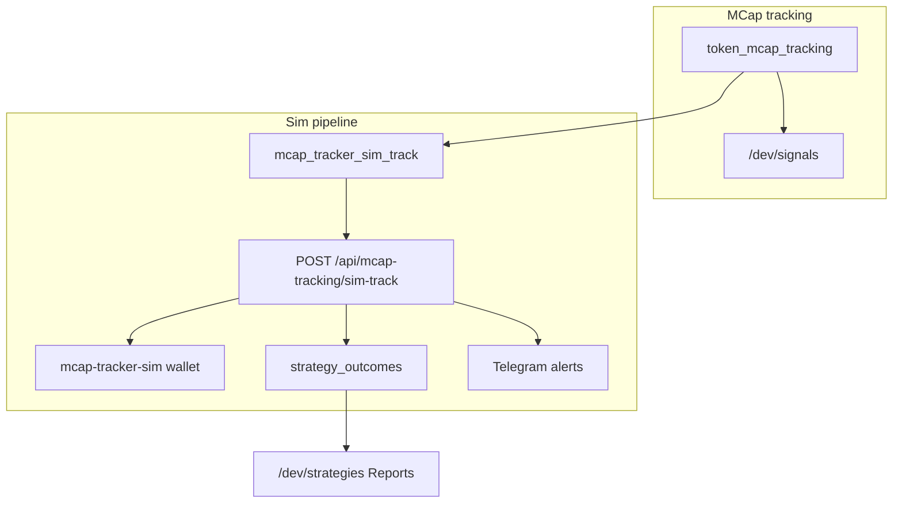
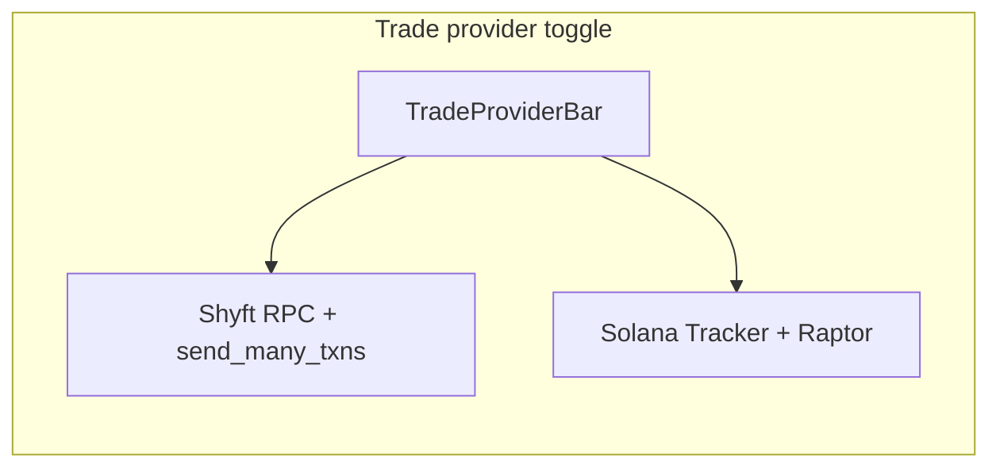

# Session Handoff

Last updated: 2026-07-04

## Goal we're working towards

Build a **dual trade-provider stack** (Shyft vs Solana Tracker + Raptor) with a universal UI toggle, Shyft bulk send (`send_many_txns`), and a reliable **mcap tracker → sim trades → strategy outcomes → Telegram** pipeline.

Secondary goals completed or in progress this session:

1. **Shyft first** — default provider and dropdown order (Shyft first, Raptor second).
2. **Milestone naming** — `when_reach_*mc` columns renamed to `when_reach_*pct` (80/120/200% growth, not market cap).
3. **Algo tester PnL** — profit/summary uses **realized** gain (`current_gain_percentage`), not peak.
4. **Strategy Reports visibility** — mcap tracker sim outcomes, open positions, and clearer separation from A/B (signals/DLMM only).

---

## Current state of the code

### Trade provider (done, committed)

| Layer | Shyft | Raptor |
|-------|-------|--------|
| Default (no pref) | yes | only if explicit |
| RPC | Shyft primary | Solana Tracker |
| Swap build | Raptor → Jupiter Lite fallback | Raptor |
| Bulk send | `send_many_txns` (2+ txs) | parallel single sends |
| UI | [`TradeProviderBar.tsx`](src/components/TradeProviderBar.tsx) on all trade pages | same |

Key files: [`src/utils/trade-provider.ts`](src/utils/trade-provider.ts), [`src/utils/swap-executor.ts`](src/utils/swap-executor.ts), [`src/utils/shyft-transaction.ts`](src/utils/shyft-transaction.ts), [`src/app/api/rpc/route.ts`](src/app/api/rpc/route.ts).

### MCap tracker milestones (done in code, DB migration may be pending on server)

- Schema uses `when_reach_80pct`, `when_reach_120pct`, `when_reach_200pct` in [`db/init/02-schema.sql`](db/init/02-schema.sql) and [`supabase/schema.sql`](supabase/schema.sql).
- Logic unchanged: timestamps set when `mcap_growth_percent` crosses 80 / 120 / 200.
- **Production DB** may still have `when_reach_*mc` until `ALTER TABLE ... RENAME COLUMN` is applied.

### Algo tester profit (done)

- [`src/utils/trending-profit.ts`](src/utils/trending-profit.ts) — `getSummaryTokenGainPct()` returns `current_gain_percentage` only.
- [`src/components/algo-tester/AlgoDashboardTab.tsx`](src/components/algo-tester/AlgoDashboardTab.tsx) — Winners tab, history cards, leaderboard use realized PnL; peak kept as secondary metric.
- Tests: [`src/utils/trending-profit.test.ts`](src/utils/trending-profit.test.ts) (4 tests passing).

### MCap sim → Reports (done in code)

- Sim open uses **entry mcap** for range check, not pumped `current_mcap` — [`src/utils/mcap-sim-track.ts`](src/utils/mcap-sim-track.ts).
- Sim batch unions recent + high-growth rows — [`fetchMcapSimCandidateRows`](src/utils/mcap-tracker.ts) used by [`sim-track/route.ts`](src/app/api/mcap-tracking/sim-track/route.ts).
- Reports API includes `open_sim_positions` — [`buildOpenMcapSimReportPositions`](src/strategies/db.ts).
- UI: coverage shows open count for `mcap_tracker`; Reports tab has open sim positions table — [`StrategyAdminHub.tsx`](src/components/strategies/StrategyAdminHub.tsx).

### Telegram (already wired, conditional)

- **Open**: `notifyStrategyOpen` on sim open in sim-track route.
- **Close**: `notifyStrategyClose` via `recordMcapTrackerOutcome` in [`src/strategies/outcomes.ts`](src/strategies/outcomes.ts).
- Requires Telegram env configured and `STRATEGY_TRACK_TELEGRAM_ENABLED !== 'false'`.
- **Does not fire** for tokens only on signals/tracker — only when sim worker opens/closes a paper trade.

### Git / deploy

- Working tree was clean at handoff (`git status` empty).
- Recent commits include Shyft trade provider, mcap fixes, algo PnL (`15c992f`, `9dbdae5`, `5bd4688`, `caab957`).

---

## Files actively edited this session

### Trade provider (earlier in session)

- [`src/components/TradeProviderBar.tsx`](src/components/TradeProviderBar.tsx)
- [`src/utils/trade-provider.ts`](src/utils/trade-provider.ts)
- [`src/app/api/rpc/route.ts`](src/app/api/rpc/route.ts)
- [`src/app/api/rpc/diagnostics/route.ts`](src/app/api/rpc/diagnostics/route.ts)
- `.env.docker.example`

### MCap milestones + sim + reports

- [`src/utils/mcap-tracker.ts`](src/utils/mcap-tracker.ts)
- [`src/utils/mcap-sim-track.ts`](src/utils/mcap-sim-track.ts)
- [`src/app/api/mcap-tracking/sim-track/route.ts`](src/app/api/mcap-tracking/sim-track/route.ts)
- [`src/strategies/db.ts`](src/strategies/db.ts)
- [`src/strategies/types.ts`](src/strategies/types.ts)
- [`src/strategies/signals-scoring.ts`](src/strategies/signals-scoring.ts)
- [`src/strategies/signals-pipeline.ts`](src/strategies/signals-pipeline.ts)
- [`src/components/signals/TrackerTab.tsx`](src/components/signals/TrackerTab.tsx)
- [`src/components/signals/SignalsTab.tsx`](src/components/signals/SignalsTab.tsx)
- [`src/components/signals/tracker-insights.ts`](src/components/signals/tracker-insights.ts)
- [`src/components/strategies/StrategyAdminHub.tsx`](src/components/strategies/StrategyAdminHub.tsx)
- [`db/init/02-schema.sql`](db/init/02-schema.sql), [`supabase/schema.sql`](supabase/schema.sql)
- Test files: `mcap-tracker-timeline`, `mcap-sim-track`, `signals-scoring`, `tracker-insights`, `trending-profit`

### Algo tester

- [`src/utils/trending-profit.ts`](src/utils/trending-profit.ts)
- [`src/components/algo-tester/AlgoDashboardTab.tsx`](src/components/algo-tester/AlgoDashboardTab.tsx)

---

## Everything tried that failed or is still broken

### 1. Shyft bulk send type mismatch (known bug, not fixed)

`ShyftManySendResponse` uses field **`results`**, but [`swap-executor.ts`](src/utils/swap-executor.ts) reads **`manyResult.items`** (~line 385). This causes TypeScript errors and would break Shyft batch submit at runtime.

Same mismatch in [`shyft-transaction.test.ts`](src/utils/shyft-transaction.test.ts) and [`swap-executor.provider.test.ts`](src/utils/swap-executor.provider.test.ts).

**Fix:** Use `manyResult.results` everywhere (or add alias — prefer one field name).

### 2. Pauly / high-growth token not in Strategy Reports (diagnosed, not a code bug alone)

Token visible on `/dev/signals` (from `token_mcap_tracking`) but not in outcomes until **`mcap_tracker_sim_track`** worker opens + closes a sim trade. User must verify worker runs on server.

Possible skip reasons before open: ML gate, max open positions, `already_closed`, worker not scheduled, token outside sim candidate batch (less likely after `fetchMcapSimCandidateRows` fix).

### 3. DB column rename on live server (not verified applied)

Code expects `when_reach_*pct`. If production still has `when_reach_*mc`, queries fail until:

```sql
ALTER TABLE token_mcap_tracking RENAME COLUMN when_reach_80mc TO when_reach_80pct;
ALTER TABLE token_mcap_tracking RENAME COLUMN when_reach_120mc TO when_reach_120pct;
ALTER TABLE token_mcap_tracking RENAME COLUMN when_reach_200mc TO when_reach_200pct;
```

### 4. A/B Results confusion (clarified, not a bug)

`mcap_tracker` strategies are `sim_only` — they never appear in A/B comparison. Look at **MCap tracker sim outcomes** and **Outcomes (ML feed)** sections instead.

### 5. Tests / tsc

- Milestone + profit unit tests pass (28 tests in targeted run).
- Full `tsc` may still fail on Shyft `items` vs `results` mismatch (unrelated to mcap work).

---

## Next steps (recommended order)

1. **Server: apply milestone column rename** if not already done (before or with deploy).
2. **Fix Shyft batch bug** — `swap-executor.ts` + tests: `items` → `results`.
3. **Server: confirm `mcap_tracker_sim_track` worker** is running; manually trigger `POST /trigger/mcap-tracker-sim-track` and check response `skipped` array for Pauly-like tokens.
4. **Verify Telegram** — ensure bot token/chat env set; expect `Strategy OPEN (SIM)` / `Strategy CLOSE (SIM)` for mcap_tracker domain.
5. **Smoke test end-to-end:**
   - Fresh browser → Shyft selected first on trade pages.
   - Bulk buy on Shyft uses `send_many_txns` (after step 2 fix).
   - Algo tester: token that peaked then dropped shows current gain in profit totals.
   - Strategies Reports: open sim positions table + closed outcomes after sim cycle.
6. **Optional:** Add worker skip-reason visibility on Workers tab or persist last sim-track result for debugging.

---

## Architecture quick reference





---

## Server checklist (copy-paste)

- [ ] Apply `when_reach_*mc` → `when_reach_*pct` migration on production DB
- [ ] Deploy latest code
- [ ] `SHYFT_API_KEY` set if using default Shyft stack
- [ ] `mcap_tracker_sim_track` worker healthy
- [ ] Telegram env + `STRATEGY_TRACK_TELEGRAM_ENABLED` not false
- [ ] Fix `swap-executor` Shyft `results` vs `items` before relying on bulk Shyft sends
