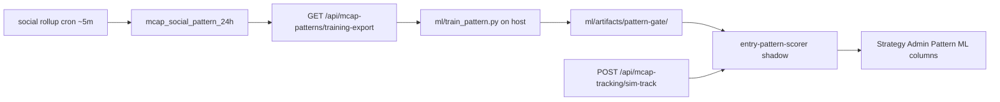

# Session Handoff

Last updated: 2026-07-05

## Primary focus

**Pattern ML** — train on 24h mcap + social cohort labels, shadow-score mcap sim entries, review in Strategy Admin / Social Admin. **Do not enforce** until `pattern_ready` in model meta.

**Data layer:** all production data lives in Docker Postgres **`reloadsol_db`**. Supabase is **cut off** — no dashboard, no egress, no fallback. Schema source: [`db/init/`](db/init/) (`02-schema.sql` + migrations `04`–`06`). [`supabase/schema.sql`](supabase/schema.sql) is a legacy mirror only.

---

## Current Pattern ML baseline

From `ml/artifacts/pattern-gate/model.meta.json` (330 train / 66 test):

| Metric | Value | Notes |
|--------|-------|-------|
| `macro_f1` | **0.468** | Below `min_macro_f1_pattern` (0.60) → `pattern_ready: false` |
| `accuracy` | 0.879 | Misleading — model predicts almost all as class 0 |
| Class 0 (loser) test | P/R/F1 = 0.88 / 1.0 / 0.94 (n=58) | Majority class dominates |
| Class 1 (winner) test | P/R/F1 = **0 / 0 / 0** (n=8) | Never predicts winners on holdout |
| Train class counts | `{0: 280, 1: 50}` | ~15% winners — severe imbalance |
| Top feature importance | `log_first_mcap` (22.8), `log_mention_count_30m` (8.4), `minutes_to_first_mention` (1.5) | Social/wallet features currently **0** |

**Ops:** `ML_PATTERN_MODE=shadow` only. Improve minority-class recall / collect more winner cohort rows before enforce.

---

## Runtime stack (Docker on VPS)

| Service | Container | Notes |
|---------|-----------|-------|
| Web | `reloadsol-web` | Next.js API + UI; ONNX shadow scorers |
| Cron | `reloadsol-cron` | Go scheduler → POST web API |
| DB | `reloadsol-db` | Postgres 16, database `reloadsol_db` |
| Pool | `reloadsol-bouncer` | PgBouncer; `DATABASE_URL` points here |
| Edge | `reloadsol-nginx` | Public `:80` → web (host `:3000` not exposed in prod) |
| Social | `reloadsol-social-ingest` | Telegram sidecar (check restart loop) |

ML artifacts: `./ml/artifacts:/app/ml/artifacts:ro`, `ML_PATTERN_ARTIFACT_DIR=/app/ml/artifacts/pattern-gate`.

---

## Pattern ML pipeline



1. **Labels:** winner ≥120% mcap growth, loser &lt;80% (`first_seen_at` in last 24h).
2. **Export (host):** `API_BASE_URL=http://127.0.0.1 TRENDING_TRACKER_SECRET=... npm run ml:export-patterns`
3. **Train (host):** `npm run ml:train-pattern` → `ml/artifacts/pattern-gate/`
4. **Deploy:** `npm run docker:deploy:web` (volume mount picks up ONNX without rebuild).
5. **Review:** `/dev/strategies` → Pattern ML + 24h cohort columns; `/dev/social` → 24h Patterns.

Check readiness: `curl -s http://127.0.0.1/api/mcap-patterns/stats | jq`.

---

## DB migrations (verify on server)

Apply via psql if not already done:

```bash
docker exec -i reloadsol-db psql -U reloadsol -d reloadsol_db < db/init/04-rename-milestone-growth-pct-columns.sql
docker exec -i reloadsol-db psql -U reloadsol -d reloadsol_db < db/init/05-signal-crosscheck.sql
docker exec -i reloadsol-db psql -U reloadsol -d reloadsol_db < db/init/06-mcap-social-patterns-24h.sql
```

Or: `bash scripts/deploy-tencent.sh schema` (idempotent).

---

## Next steps (recommended order)

1. **Stay shadow** — do not set `ML_PATTERN_MODE=enforce` (class-1 recall 0 on test).
2. **Fix social-ingest** if container is restart-looping (Telegram session/config).
3. **Collect more winner cohort rows** — imbalance is the main blocker, not just retrain cadence.
4. **Weekly retrain:** export → train → `docker:deploy:web` → compare shadow vs 24h cohort in Strategy Admin.
5. **Sim-outcome gate (secondary):** keep `ML_GATE_MODE=shadow`; see [ML_GATE_PLAN.md](docs/ML_GATE_PLAN.md).

---

## Doc map

| Doc | Use when |
|-----|----------|
| [docs/ARCHITECTURE_SUMMARY.md](docs/ARCHITECTURE_SUMMARY.md) | Whole picture — algo, Pattern ML, next steps |
| [docs/algo_overview.md](docs/algo_overview.md) | Per-strategy capture/calculate/result, workers, gap diagnosis |
| [docs/OPERATOR_STATE.md](docs/OPERATOR_STATE.md) | Live ops, retrain loops, constraints |
| [docs/architecture.md](docs/architecture.md) | System topology, tables, deploy model |
| [ml/README.md](ml/README.md) | Python setup, Pattern ML train commands |

---

## Server checklist

- [ ] Migrations `04`–`06` applied on `reloadsol_db`
- [ ] `ML_PATTERN_MODE=shadow`, artifacts mounted at `/app/ml/artifacts/pattern-gate`
- [ ] Host export uses `API_BASE_URL=http://127.0.0.1` (nginx :80, not `:3000`)
- [ ] `TRENDING_TRACKER_SECRET` set for training-export auth
- [ ] `mcap_tracker_sim_track` + `social_rollup` workers healthy
- [ ] `reloadsol-social-ingest` not restart-looping
- [ ] Review Pattern ML vs 24h cohort weekly before considering enforce
